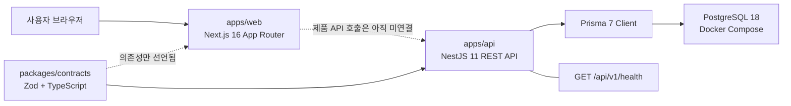
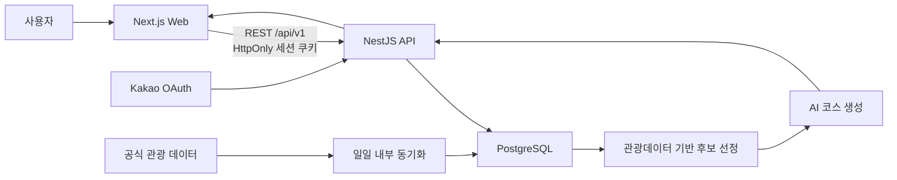
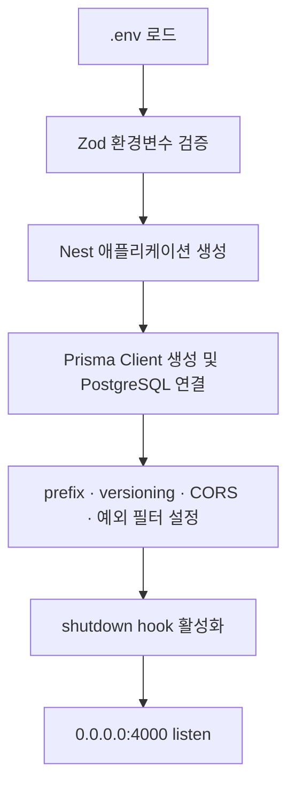
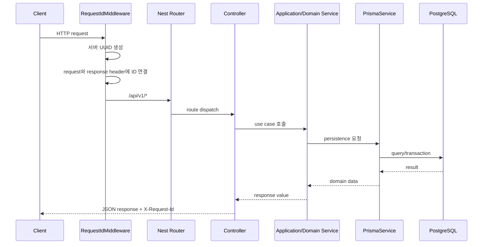

# Haetteum Architecture

## 문서의 역할

- **상태:** Active
- **마지막 갱신:** 2026-08-20
- **기준:** 현재 작업 트리의 코드와 설정

이 문서는 Haetteum의 프론트엔드, 백엔드, 공유 계약, 데이터베이스가 어떤
경계로 나뉘고 어떻게 데이터를 주고받는지를 설명하는 전체 기술 아키텍처의 기준
문서다.

문서별 책임은 다음과 같이 구분한다.

- `README.md`: 설치, 실행 방법, 로컬 개발 명령
- `ARCHITECTURE.md`: 시스템 전체 구조, 의존 방향, 데이터 흐름
- `DESIGN.md`: UI/UX, 디자인 토큰, 프론트엔드 표현 계층
- `docs/superpowers/specs`: 특정 변경을 시작할 때 승인한 설계 기록
- `docs/superpowers/plans`: 승인된 설계를 구현하기 위한 시점별 작업 계획

현재 코드와 향후 방향이 섞이지 않도록 아래 상태를 사용한다.

| 상태 | 의미 |
|---|---|
| ✅ 구현됨 | 현재 작업 트리에 코드 또는 설정이 존재한다. |
| 🔒 방향 확정 | 제품 방향은 합의됐지만 아직 코드로 구현되지 않았다. |
| 🧭 검토 필요 | 구체적인 설계나 기술 선택이 아직 확정되지 않았다. |

`✅ 구현됨`은 파일 존재 여부와 코드 구조를 의미한다. 실제 외부 서비스 연결이나
운영 환경 동작까지 자동으로 보장하지 않는다.

## 1. 아키텍처 원칙

Haetteum은 pnpm Workspace 기반 모노레포이며, 웹과 API를 서로 독립된
애플리케이션으로 유지한다.

1. 웹은 화면과 사용자 상호작용을 소유하고 데이터베이스에 직접 접근하지 않는다.
2. API는 비즈니스 규칙, 인증, 데이터 저장과 외부 데이터 연동을 소유한다.
3. 웹과 API 사이의 HTTP 경계는 `@haetteum/contracts`의 Zod 스키마와
   TypeScript 타입으로 공유한다.
4. Prisma 모델과 생성 타입은 API 내부 구현이며 HTTP 계약으로 노출하지 않는다.
5. 현재 구현과 향후 설계를 같은 사실처럼 기록하지 않는다.
6. 외부 관광 데이터는 공식 API 또는 공식 다운로드만 사용하고 웹 페이지를
   스크래핑하지 않는다.

## 2. 전체 시스템 구성

### 2.1 현재 구현



현재 웹에는 디자인 시스템과 여행 정보 표현 컴포넌트가 구현되어 있다. API에는
공통 HTTP 경계, 환경변수 검증, Prisma 연결과 health endpoint가 구현되어 있다.
웹에서 API를 호출하는 제품 데이터 흐름, 인증, 여행 도메인과 AI 추천은 아직
구현되지 않았다.

### 2.2 확정된 제품 방향



이 그림은 제품 수준에서 확정된 방향을 나타낼 뿐, 세션 저장소, 도메인 스키마,
외부 AI 제공자와 각 API 계약이 구현됐다는 의미는 아니다.

## 3. 저장소 구조

빌드 결과물인 `.next`, `dist`, `coverage`와 Prisma 생성 코드는 아래 구조에서
제외한다.

```text
haetteum/
├── apps/
│   ├── web/                         # ✅ Next.js 웹 애플리케이션
│   │   ├── public/
│   │   │   ├── icons/               # 브라우저, Apple touch, PWA 아이콘
│   │   │   └── images/              # 제품 소유 정적 이미지
│   │   ├── src/
│   │   │   ├── app/                 # App Router layout과 route
│   │   │   │   └── design-system/   # 개발 환경 전용 확인 화면
│   │   │   ├── components/
│   │   │   │   ├── ui/              # 범용 UI primitive
│   │   │   │   ├── travel/          # 여행 데이터 표현 컴포넌트
│   │   │   │   └── design-system/   # 디자인 시스템 preview
│   │   │   ├── lib/                 # 프론트엔드 공통 유틸리티
│   │   │   └── styles/              # 토큰, 타이포그래피, safe area
│   │   └── tests/                    # Vitest + Testing Library 단위 테스트
│   │
│   └── api/                          # ✅ NestJS REST API
│       ├── prisma/
│       │   └── schema.prisma         # Prisma generator와 PostgreSQL datasource
│       ├── src/
│       │   ├── common/http/          # 요청 ID, 오류 변환, Zod 검증
│       │   ├── config/               # API 환경변수 검증
│       │   ├── health/               # 데이터베이스 health endpoint
│       │   ├── prisma/               # Prisma lifecycle과 DB 접근 기반
│       │   ├── app.module.ts         # 루트 Nest module
│       │   ├── configure-app.ts      # prefix, versioning, CORS, filter
│       │   └── main.ts               # API bootstrap
│       └── test/                      # Jest + Supertest e2e 테스트
│
├── packages/
│   └── contracts/                    # ✅ 웹·API 공유 HTTP 계약
│       └── src/
│           ├── health.ts
│           ├── problem-details.ts
│           └── index.ts
│
├── compose.yaml                      # ✅ 로컬 PostgreSQL
├── package.json                      # workspace 실행 조정
├── pnpm-workspace.yaml
├── README.md
├── ARCHITECTURE.md
└── DESIGN.md
```

아직 존재하지 않는 주요 계층은 다음과 같다.

- `apps/web/src/components/patterns`: 여러 표현 컴포넌트의 화면 단위 조합
- `apps/web/src/features`: API 데이터와 사용자 흐름을 기능별로 연결
- API의 인증, 사용자, 여행지, 여행, 일정, 추천, 동기화 도메인 모듈
- Prisma 도메인 모델과 첫 migration

## 4. Workspace 경계와 의존 방향

```text
@haetteum/web ──→ @haetteum/contracts ←── @haetteum/api
                                               │
                                               ↓
                                      Prisma → PostgreSQL
```

| Workspace | 소유하는 것 | 의존하면 안 되는 것 |
|---|---|---|
| `@haetteum/web` | route, 화면 조립, 브라우저 상태, API 소비 | Prisma Client, API 내부 module |
| `@haetteum/api` | HTTP API, 비즈니스 규칙, 외부 연동, 영속성 | 웹 컴포넌트, 브라우저 상태 |
| `@haetteum/contracts` | HTTP 요청·응답 Zod 스키마와 타입 | React, Next, Nest, Prisma |
| 저장소 루트 | workspace 명령과 개발 인프라 조정 | 애플리케이션 런타임 로직 |

웹과 API는 서로의 소스 코드를 직접 import하지 않는다. 두 애플리케이션이 공유해야
하는 값은 HTTP 계약일 때만 `packages/contracts`로 올린다. API 내부 DTO나 Prisma
타입을 편의상 공유 패키지로 옮기지 않는다.

## 5. 프론트엔드 아키텍처

### 5.1 현재 기술 기반

- Next.js 16.3.1 App Router
- React 19.2.8
- TypeScript strict mode
- Tailwind CSS 4 CSS-first 구성
- shadcn/ui + Base UI + Rhea 스타일
- CSS variable 기반 semantic token
- Vitest + React Testing Library + axe-core

React Query, Zustand와 Zod 의존성은 설치되어 있지만, 현재 제품 route에는 Query
Client provider, 전역 store 또는 API 데이터 연결이 구현되어 있지 않다.

### 5.2 UI 소유권 계층

```text
styles
  primitive/semantic token, typography, safe area
        ↓
components/ui
  도메인을 모르는 범용 UI와 접근성 primitive
        ↓
components/travel
  여행지, 후기, 평점, 일정의 표현 컴포넌트
        ↓
components/patterns                 🔒 아직 미구현
  여러 컴포넌트의 화면 단위 조합
        ↓
features / app routes               🔒 제품 흐름은 아직 미구현
  API 연결, 브라우저 상태, 사용자 흐름, 페이지 조립
```

현재 구현된 범용 컴포넌트는 `Button`, `Toggle`, `ToggleGroup`, `Card`다. 여행
표현 컴포넌트는 `PlaceCard`, `RatingSummary`, `ProviderBadge`, `ReviewCard`,
`ItineraryItem`이다. 이 컴포넌트들은 API 요청이나 route 이동을 소유하지 않고,
명시적인 props로 받은 값만 표현한다.

### 5.3 Route 상태

| Route | 현재 상태 | 책임 |
|---|---|---|
| `/` | ✅ 임시 foundation 화면 | 현재는 Haetteum 제목만 표시한다. 최종적으로 여행 탐색 메인이 된다. |
| `/design-system` | ✅ 개발 환경 전용 | 토큰과 컴포넌트 상태를 확인한다. production에서는 404다. |
| `/welcome` | 🔒 미구현 | 웰컴 화면이며 CTA `여행 시작하기`는 `/`로 이동한다. |
| 후기·여행 경로 화면 | 🧭 route 미확정 | 최종 메뉴명과 route 구조를 결정해야 한다. |

`/`와 `/welcome`의 최종 책임은 확정되어 있지만 현재 페이지 구현과 같지 않다.

### 5.4 프론트엔드의 향후 데이터 경계

제품 API 연결 시의 현재 기술 방향은 다음과 같다. 세부 상태 관리 정책은 첫 제품
flow 설계에서 최종 확정한다.

1. `app` route는 URL 경계와 화면 조립을 담당한다.
2. `features`는 API query/mutation, 사용자 행동과 화면 상태를 담당한다.
3. 서버 상태에는 React Query, 필요한 제한적 브라우저 UI 상태에는 Zustand를
   사용하는 방향을 우선 검토한다.
4. API 응답은 `@haetteum/contracts` 스키마로 경계에서 검증한다.
5. `components/travel`에는 API response 전체를 넘기지 않고 화면에 필요한 값만
   props로 전달한다.

구체적인 provider 배치, query key, store 범위와 Server Component에서의
prefetch 정책은 실제 첫 제품 flow 설계에서 확정한다.

## 6. 백엔드 아키텍처

### 6.1 현재 기술 기반

- NestJS 11.2.1
- REST API와 URI versioning
- Prisma 7.9.1 + PostgreSQL adapter
- PostgreSQL 18.4 Docker Compose
- Zod 4 기반 환경변수와 HTTP 입력 검증 기반
- Jest + Supertest

현재 `AppModule`에는 `ConfigModule`, `PrismaModule`, `HealthModule`만 연결되어
있다. 도메인 비즈니스 module은 아직 없다.

### 6.2 서버 부팅 흐름



필수 환경변수가 없거나 올바르지 않으면 API는 listen 전에 실패한다. Prisma는
module 초기화 때 연결하고 종료 때 연결을 해제한다.

### 6.3 HTTP 요청 흐름



현재는 health controller만 존재하므로 `Application/Domain Service` 단계는 향후
도메인 API가 추가될 때 생긴다.

### 6.4 API 공통 규칙

- 전역 prefix는 `/api`, 기본 URI version은 `v1`이다.
- 성공 응답은 공통 `{ data }` envelope 없이 endpoint 계약을 직접 반환한다.
- 오류 응답은 `application/problem+json` 형식의 Problem Details로 통일한다.
- 모든 요청에는 서버가 생성한 UUID를 부여하고 `X-Request-Id`에도 반환한다.
- 예상하지 못한 5xx 응답에는 stack, SQL, 환경변수와 내부 오류 메시지를
  노출하지 않는다.
- CORS는 `WEB_ORIGIN`과 정확히 일치하는 origin만 허용하며 쿠키 인증을 위해
  `credentials: true`를 사용한다.
- HTTP body, params, query를 계약별로 검증할 수 있는 공통
  `ZodValidationPipe` 기반이 구현되어 있다.

### 6.5 도메인 모듈 방향

MVP의 제품 범위는 회원, 여행지 조회, 일정 생성·수정·저장, AI 여행 코스
생성이다. 이를 위한 후보 경계는 아래와 같지만 module 이름과 내부 분리는 최종
설계에서 변경될 수 있다.

| 후보 경계 | 책임 | 상태 |
|---|---|---|
| `auth` | Kakao OAuth, 서버 세션, 로그인 상태 | 🔒 방향 확정, 미구현 |
| `users` | 사용자 프로필과 계정 상태 | 🔒 범위 확정, 미구현 |
| `places` | 동기화된 여행지 조회 | 🔒 범위 확정, 미구현 |
| `trips` | 사용자 여행과 저장 단위 | 🔒 범위 확정, 미구현 |
| `itineraries` | 일정 생성, 수정, 순서와 저장 | 🔒 범위 확정, 미구현 |
| `recommendations` | 후보 선정과 AI 코스 생성 조정 | 🔒 방향 확정, 미구현 |
| 관광 데이터 동기화 | 공식 데이터 수집, 정규화, 갱신 | 🔒 일일 동기화 방향 확정, 미구현 |

세션 저장소, 각 module의 entity와 service 경계, 트랜잭션 범위, API endpoint와
Prisma schema는 아직 검토가 필요하다.

## 7. 공유 계약

`@haetteum/contracts`는 웹과 API가 합의하는 런타임 스키마와 TypeScript 타입의
단일 기준이다.

현재 계약은 다음 두 영역만 제공한다.

| 계약 | 용도 |
|---|---|
| `HealthResponseSchema` | 데이터베이스 health 성공 응답 검증 |
| `ProblemDetailsSchema` | 모든 API 오류의 공통 응답 검증 |
| `ValidationIssueSchema` | 입력 검증 실패의 field path와 message |

새 endpoint를 추가할 때는 요청과 응답 스키마를 계약 패키지에 먼저 정의하고,
API는 그 계약에 맞춰 반환하며 웹은 네트워크 경계에서 이를 검증한다. Nest
decorator, Prisma model과 UI component props는 공유 계약에 넣지 않는다.

## 8. 데이터베이스와 환경변수

### 8.1 현재 데이터베이스 범위

Prisma schema에는 generator와 PostgreSQL datasource만 있고 도메인 model이나
migration은 없다. 따라서 현재 데이터베이스는 연결과 health check 기반만
제공한다.

PostgreSQL은 로컬에서 Docker Compose로 실행하고 named volume
`haetteum_postgres_data`에 데이터를 보존한다. `pnpm db:down`은 volume을
삭제하지 않는다.

### 8.2 환경변수 경계

```text
/.env                  # Docker Compose 전용, Git 제외
/apps/api/.env         # Nest와 Prisma 전용, Git 제외
/apps/web/.env.local   # 공개 가능한 웹 런타임 설정, Git 제외
```

예시 파일은 `.env.example`, `apps/api/.env.example`,
`apps/web/.env.example`에 둔다. 실제 자격증명과 provider key는 예시 파일이나
Git에 기록하지 않는다.

브라우저에 노출되는 `NEXT_PUBLIC_*` 값에는 비밀정보를 넣지 않는다.

## 9. 현재 구현된 데이터 흐름

### 9.1 웹 화면 렌더링

```text
브라우저 요청
  → Next.js App Router
  → root layout
  → route page
  → styles / UI / travel 표현 컴포넌트
  → HTML과 React UI 응답
```

현재 `/`는 API 요청 없이 정적 foundation 화면을 렌더링한다.

### 9.2 Health check

```text
GET /api/v1/health
  → RequestIdMiddleware
  → HealthController
  → PrismaHealthIndicator
  → PrismaService
  → PostgreSQL ping
  → HealthResponse JSON 또는 Problem Details
```

정상 결과는 `HealthResponseSchema`, 오류 결과는 `ProblemDetailsSchema`로 검증할
수 있다.

### 9.3 개발 실행

```text
pnpm dev
  → @haetteum/contracts build
  → Prisma Client generate
  → @haetteum/web과 @haetteum/api 병렬 실행
```

프로덕션 build는 contracts → API → web 순서로 실행한다.

## 10. 확정된 향후 데이터 흐름

아래 흐름은 제품 방향은 확정됐지만 아직 구현되지 않았다.

### 10.1 Kakao 로그인과 서버 세션

```text
사용자 → 웹에서 Kakao 로그인 시작
  → Nest API의 OAuth 경계
  → Kakao 인증과 사용자 식별
  → 사용자 조회 또는 생성
  → 서버 세션 생성
  → HttpOnly 쿠키 설정
  → 이후 API 요청에서 세션으로 사용자 확인
```

인증 제공자는 MVP에서 Kakao 하나만 사용한다. 토큰을 브라우저 저장소에 직접
보관하는 구조가 아니라 서버 세션 방식을 사용한다. 세션 저장소, 만료·회전·폐기
정책과 OAuth callback 계약은 후속 설계에서 확정한다.

### 10.2 공식 관광 데이터 동기화

```text
일일 내부 작업
  → 공식 API 또는 공식 다운로드 조회
  → 원본 응답 검증
  → 외부 식별자 기준 정규화와 upsert
  → 지역·여행지 메타데이터 저장
  → 사용자 조회 API에서 제공
```

TourAPI 계열의 장소 메타데이터와 관광데이터랩 계열의 수요·순위 데이터는 출처와
갱신 조건이 다르므로 수집 경계를 분리한다. 각 데이터셋의 이용 조건, quota,
갱신 주기와 실제 제공 필드는 구현 직전에 공식 문서로 다시 확인한다.

### 10.3 AI 여행 코스 생성

```text
사용자가 여행 조건 입력
  → API 입력 검증
  → 동기화된 관광데이터에서 후보 선정
  → 후보와 사용자 조건을 AI 입력으로 구성
  → AI가 코스 초안 생성
  → API가 결과 검증과 정규화
  → 사용자에게 반환
  → 사용자가 수정 후 일정으로 저장
```

AI가 임의의 장소를 처음부터 생성하지 않고 관광데이터에서 선정한 후보를 기반으로
코스를 만든다. MVP에는 장소별 체류시간 계산을 포함하지 않는다. AI 제공자,
구조화 출력 schema, 재시도·timeout·fallback 정책은 아직 검토가 필요하다.

## 11. 구현 상태 요약

| 영역 | 상태 | 현재 범위 |
|---|---|---|
| pnpm Workspace | ✅ | web, api, contracts 분리 |
| 프론트엔드 foundation | ✅ | 토큰, 범용 UI, 여행 표현 컴포넌트, preview |
| 제품 페이지 | 🔒 | `/` 메인과 `/welcome` 책임만 확정, 화면 미구현 |
| 프론트엔드 API 연결 | 🧭 | base URL 예시만 존재 |
| NestJS HTTP foundation | ✅ | v1, CORS, request ID, Problem Details, Zod pipe |
| PostgreSQL 연결 | ✅ | Prisma lifecycle와 health check |
| 공유 계약 | ✅ | health와 Problem Details |
| Kakao 서버 세션 인증 | 🔒 | 방식만 확정, 미구현 |
| 사용자·여행지·여행·일정 | 🔒 | MVP 범위만 확정, schema/API 미구현 |
| 관광 데이터 동기화 | 🔒 | 공식 소스와 일일 동기화 방향 확정, 미구현 |
| AI 코스 생성 | 🔒 | 관광데이터 후보 기반 방향 확정, 미구현 |
| 배포·CI/CD·관측성 | 🧭 | 미설계 |

## 12. 아직 결정해야 하는 항목

- 세션 저장소와 세션 lifecycle
- 사용자, 여행지, 여행, 일정의 Prisma schema와 관계
- REST endpoint, 요청·응답 계약과 pagination 규칙
- 공식 관광 데이터셋별 필드, quota, 장애와 재동기화 전략
- 일일 동기화 실행 방식과 중복 실행 제어
- AI 제공자, 구조화 출력, timeout, 재시도와 비용 제한
- 지도와 위치 데이터 제공자 및 클라이언트 경계
- 배포 환경, 비밀정보 관리, CI/CD와 운영 관측성
- 후기·여행 경로 화면의 최종 route와 하단 내비게이션 계약

이 항목은 구현 중 임의로 결정하지 않고 해당 기능의 설계 문서에서 비교·승인한 뒤
이 문서에 반영한다.

## 13. 변경 규칙

다음 변경이 생기면 같은 작업에서 이 문서를 함께 갱신한다.

- workspace, 애플리케이션 또는 공통 패키지를 추가·삭제할 때
- 프론트엔드 또는 백엔드 계층의 소유권이 달라질 때
- 새로운 데이터 저장소, 외부 provider 또는 백그라운드 작업을 추가할 때
- 인증·세션·API versioning·오류 계약이 바뀔 때
- 주요 데이터 흐름이 구현되거나 확정 상태가 달라질 때

UI 토큰과 컴포넌트 세부 규칙은 `DESIGN.md`, 특정 변경의 선택 근거는 해당
`docs/superpowers/specs` 문서에 기록하고 여기에는 전체 시스템에 영향을 주는
결론만 반영한다.
