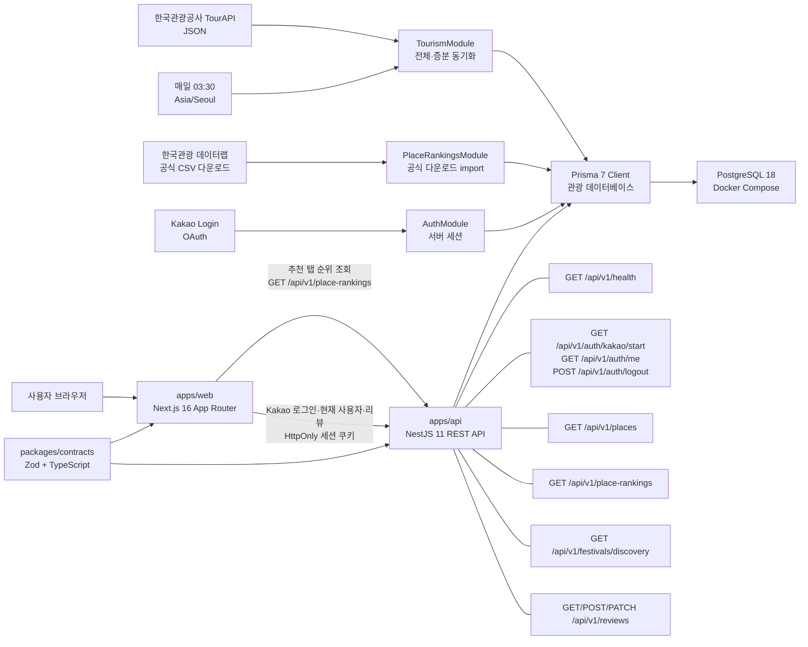
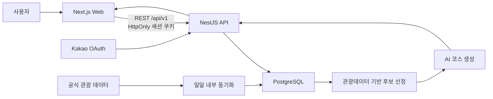
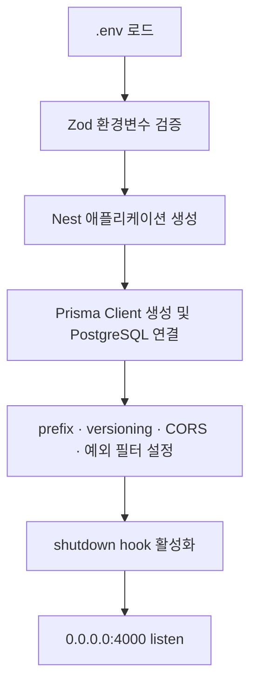
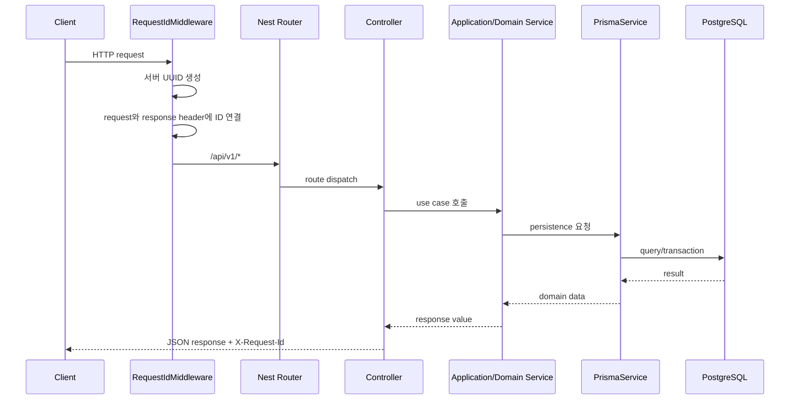

# Haetteum Architecture

## 문서의 역할

- **상태:** Active
- **마지막 갱신:** 2026-08-27
- **기준:** 현재 작업 트리의 코드와 설정

이 문서는 Haetteum의 프론트엔드, 백엔드, 공유 계약, 데이터베이스가 어떤
경계로 나뉘고 어떻게 데이터를 주고받는지를 설명하는 전체 기술 아키텍처의 기준
문서다.

문서별 책임은 다음과 같이 구분한다.

- `README.md`: 설치, 실행 방법, 로컬 개발 명령
- `ARCHITECTURE.md`: 시스템 전체 구조, 의존 방향, 데이터 흐름
- `DESIGN.md`: UI/UX, 디자인 토큰, 프론트엔드 표현 계층
- `docs/ERD.md`: 관광 데이터베이스의 현재 관계와 확장 예정 구조
- `docs/superpowers/specs`: 특정 변경을 시작할 때 승인한 설계 기록
- `docs/superpowers/plans`: 승인된 설계를 구현하기 위한 시점별 작업 계획

현재 코드와 향후 방향이 섞이지 않도록 아래 상태를 사용한다.

| 상태         | 의미                                                |
| ------------ | --------------------------------------------------- |
| ✅ 구현됨    | 현재 작업 트리에 코드 또는 설정이 존재한다.         |
| 🔒 방향 확정 | 제품 방향은 합의됐지만 아직 코드로 구현되지 않았다. |
| 🧭 검토 필요 | 구체적인 설계나 기술 선택이 아직 확정되지 않았다.   |

`✅ 구현됨`은 파일 존재 여부와 코드 구조를 의미한다. 실제 외부 서비스 연결이나
운영 환경 동작까지 자동으로 보장하지 않는다.

## 1. 아키텍처 원칙

Haetteum은 pnpm Workspace 기반 모노레포이며, 웹과 API를 서로 독립된
애플리케이션으로 유지한다.

1. 웹은 화면과 사용자 상호작용을 소유하고 데이터베이스에 직접 접근하지 않는다.
2. API는 비즈니스 규칙, 인증, 데이터 저장과 외부 데이터 연동을 소유한다.
3. 웹과 API 사이의 HTTP 경계는 `@haetteum/contracts`의 Zod 스키마와
   TypeScript 타입으로 공유한다.
4. Prisma 모델과 생성 타입은 API 내부 구현이며 HTTP 계약으로 노출하지 않는다.
5. 현재 구현과 향후 설계를 같은 사실처럼 기록하지 않는다.
6. 외부 관광 데이터는 공식 API 또는 공식 다운로드만 사용하고 웹 페이지를
   스크래핑하지 않는다.

## 2. 전체 시스템 구성

### 2.1 현재 구현



현재 웹에는 디자인 시스템과 여행 정보 표현 컴포넌트가 구현되어 있다. API에는
공통 HTTP 경계, 환경변수 검증, Prisma 연결, health endpoint, TourAPI JSON
client, 관광지 전체·증분 동기화, 축제 동기화 기반, PostgreSQL 기반 관광지·축제
조회 endpoint가 구현되어 있다. 메인 추천 탭의 세대별 인기관광지 순위는 웹 서버
컴포넌트가 `GET /api/v1/place-rankings`를 호출해 표시한다. Kakao Login 기반 서버
세션, 현재 사용자 조회, 현재 세션 로그아웃, 그리고 세션 사용자 기준 리뷰 소유권
검사가 구현되어 있다. AI 추천 저장 흐름은 아직 구현되지 않았다.

### 2.2 확정된 제품 방향



이 그림은 제품 수준에서 확정된 전체 방향이다. 이 중 TourAPI 기반 관광지
동기화·조회, 축제 discovery 조회, 데이터랩 기반 세대별 순위 조회, Kakao 서버
세션 인증과 사용자 리뷰 소유권 검사는 구현됐지만, 외부 AI 제공자와 여행·일정
저장 계약은 아직 구현되지 않았다.

## 3. 저장소 구조

빌드 결과물인 `.next`, `dist`, `coverage`와 Prisma 생성 코드는 아래 구조에서
제외한다.

```text
haetteum/
├── apps/
│   ├── web/                         # ✅ Next.js 웹 애플리케이션
│   │   ├── public/
│   │   │   ├── icons/               # 브라우저, Apple touch, PWA 아이콘
│   │   │   └── images/              # 제품 소유 정적 이미지
│   │   ├── src/
│   │   │   ├── app/                 # App Router layout과 route
│   │   │   │   └── design-system/   # 개발 환경 전용 확인 화면
│   │   │   ├── components/
│   │   │   │   ├── ui/              # 범용 UI primitive
│   │   │   │   ├── travel/          # 여행 데이터 표현 컴포넌트
│   │   │   │   ├── patterns/        # 화면 단위 조합 컴포넌트
│   │   │   │   └── design-system/   # 디자인 시스템 preview
│   │   │   ├── features/            # API adapter와 기능별 화면 상태 연결
│   │   │   ├── lib/                 # 프론트엔드 공통 유틸리티
│   │   │   └── styles/              # 토큰, 타이포그래피, safe area
│   │   └── tests/                    # Vitest + Testing Library 단위 테스트
│   │
│   └── api/                          # ✅ NestJS REST API
│       ├── prisma/
│       │   ├── migrations/            # 관광 데이터, DB comment, 축제, 순위 migration
│       │   └── schema.prisma         # 관광 데이터 기반 모델과 PostgreSQL datasource
│       ├── src/
│       │   ├── auth/                 # Kakao OAuth, HttpOnly 세션, current user, logout
│       │   ├── common/http/          # 요청 ID, 오류 변환, Zod 검증
│       │   ├── config/               # API 환경변수 검증
│       │   ├── festivals/            # 동기화된 축제 공개 조회 API
│       │   ├── health/               # 데이터베이스 health endpoint
│       │   ├── places/               # 동기화된 관광지 공개 조회 API
│       │   ├── place-rankings/       # 데이터랩 공식 다운로드 순위 import와 공개 조회 API
│       │   ├── prisma/               # Prisma lifecycle과 DB 접근 기반
│       │   ├── reviews/              # 세션 사용자 기준 리뷰 CRUD API
│       │   ├── tourism/              # TourAPI client, mapper, sync, scheduler, command
│       │   ├── app.module.ts         # 루트 Nest module
│       │   ├── configure-app.ts      # prefix, versioning, CORS, filter
│       │   └── main.ts               # API bootstrap
│       └── test/                      # Jest + Supertest e2e 테스트
│
├── packages/
│   └── contracts/                    # ✅ 웹·API 공유 HTTP 계약
│       └── src/
│           ├── auth.ts
│           ├── health.ts
│           ├── festivals.ts
│           ├── places.ts
│           ├── place-rankings.ts
│           ├── reviews.ts
│           ├── problem-details.ts
│           └── index.ts
│
├── compose.yaml                      # ✅ 로컬 PostgreSQL
├── package.json                      # workspace 실행 조정
├── pnpm-workspace.yaml
├── README.md
├── ARCHITECTURE.md
└── DESIGN.md
```

아직 존재하지 않는 주요 계층은 API의 여행, 일정, 추천 도메인 모듈과 회원
탈퇴·Kakao unlink를 포함한 계정 관리 모듈이다.

Prisma schema에는 관광 데이터 기반인 `TourismRegion`, `TourismDistrict`, `Place`,
`TourismSyncRun`, `PlaceRanking`, `Festival` 모델과 사용자 기능 기반인 `User`,
`Session`, `Review` 모델이 구현되어 있다. 기반·DB comment·시군구 복합
unique·축제·순위 스냅샷·사용자·리뷰·세션 migration이 구현되어 있다.

## 4. Workspace 경계와 의존 방향

```text
@haetteum/web ──→ @haetteum/contracts ←── @haetteum/api
                                               │
                                               ↓
                                      Prisma → PostgreSQL
```

| Workspace             | 소유하는 것                                | 의존하면 안 되는 것            |
| --------------------- | ------------------------------------------ | ------------------------------ |
| `@haetteum/web`       | route, 화면 조립, 브라우저 상태, API 소비  | Prisma Client, API 내부 module |
| `@haetteum/api`       | HTTP API, 비즈니스 규칙, 외부 연동, 영속성 | 웹 컴포넌트, 브라우저 상태     |
| `@haetteum/contracts` | HTTP 요청·응답 Zod 스키마와 타입           | React, Next, Nest, Prisma      |
| 저장소 루트           | workspace 명령과 개발 인프라 조정          | 애플리케이션 런타임 로직       |

웹과 API는 서로의 소스 코드를 직접 import하지 않는다. 두 애플리케이션이 공유해야
하는 값은 HTTP 계약일 때만 `packages/contracts`로 올린다. API 내부 DTO나 Prisma
타입을 편의상 공유 패키지로 옮기지 않는다.

## 5. 프론트엔드 아키텍처

### 5.1 현재 기술 기반

- Next.js 16.3.1 App Router
- React 19.2.8
- TypeScript strict mode
- Tailwind CSS 4 CSS-first 구성
- shadcn/ui + Base UI + Rhea 스타일
- CSS variable 기반 semantic token
- Vitest + React Testing Library + axe-core

React Query와 Zod 의존성은 설치되어 있고, Zustand는 인증 표시용 in-memory
store에 사용한다. 추천 탭의 일부 데이터와 인증·리뷰 화면은 서버 컴포넌트와
feature adapter를 통해 API에 연결되어 있다. Zustand 상태는 프로덕션 브라우저에
debug 노출하지 않으며, 2026-08-27 검증은 실제 navigation/logout 동작과 focused
store 테스트에 근거한다.

### 5.2 UI 소유권 계층

```text
styles
  primitive/semantic token, typography, safe area
        ↓
components/ui
  도메인을 모르는 범용 UI와 접근성 primitive
        ↓
components/travel
  여행지, 후기, 평점, 일정의 표현 컴포넌트
        ↓
components/patterns
  여러 컴포넌트의 화면 단위 조합
        ↓
features / app routes
  API 연결, 브라우저 상태, 사용자 흐름, 페이지 조립
```

현재 구현된 범용 컴포넌트는 `Button`, `Toggle`, `ToggleGroup`, `Card`다. 여행
표현 컴포넌트는 `PlaceCard`, `RatingSummary`, `ProviderBadge`, `ReviewCard`,
`ItineraryItem`, `PlaceRankingCard`다. `features/discovery`는 세대별 순위 API
adapter와 URL query 기반 필터를 연결한다. 현재 tree에는 축제 discovery API
adapter와 축제 표현 컴포넌트도 존재하지만, 이 문서는 이번 정합성 수정에서
프론트엔드 축제 화면 동작을 추가 검증하지 않았다. 여행 표현 컴포넌트는 API
요청을 직접 소유하지 않고, 명시적인 props로 받은 값만 표현한다.

### 5.3 Route 상태

| Route               | 현재 상태              | 책임                                                                                                |
| ------------------- | ---------------------- | --------------------------------------------------------------------------------------------------- |
| `/`                 | ✅ 메인 탐색 화면      | 추천 탭에서 세대별 인기관광지 순위와 기존 탐색 섹션을 표시한다.                                     |
| `/design-system`    | ✅ 개발 환경 전용      | 토큰과 컴포넌트 상태를 확인한다. production에서는 404다.                                            |
| `/welcome`          | 🔒 미구현              | 웰컴 화면이며 CTA `여행 시작하기`는 `/`로 이동한다.                                                 |
| `/login`            | ✅ Kakao 로그인 화면   | Nest OAuth 시작 endpoint로 이동하며 보호 route의 `returnTo`를 보존한다.                             |
| `/reviews`          | ✅ 보호된 내 리뷰 화면 | 서버 세션 없으면 `/login?returnTo=%2Freviews`로 redirect하고, 로그인 후 본인 리뷰만 표시한다.       |
| `/mypage`           | ✅ 보호된 내 페이지    | 실제 Kakao nickname/profile image와 truthful count를 표시하고 현재 Haetteum 세션 logout을 제공한다. |
| 여행·일정 저장 화면 | 🧭 검토 필요           | 최종 route 구조와 저장 계약을 결정해야 한다.                                                        |

`/welcome`의 최종 제품 copy와 CTA 책임은 확정되어 있지만 현재 페이지 구현과
다를 수 있다.

### 5.4 프론트엔드 데이터 경계

제품 API 연결 시의 현재 기술 방향은 다음과 같다. 구현된 auth/review 흐름은 이
방향을 따른다. 아직 구현하지 않은 제품 flow의 세부 provider 배치와 query key는
각 기능 설계에서 최종 확정한다.

1. `app` route는 URL 경계와 화면 조립을 담당한다.
2. `features`는 API query/mutation, 사용자 행동과 화면 상태를 담당한다.
3. 서버 상태에는 React Query, 필요한 제한적 브라우저 UI 상태에는 Zustand를
   사용한다. 현재 Zustand 사용 범위는 인증 표시용 in-memory store다.
4. API 응답은 `@haetteum/contracts` 스키마로 경계에서 검증한다.
5. `components/travel`에는 API response 전체를 넘기지 않고 화면에 필요한 값만
   props로 전달한다.

구체적인 Server Component prefetch 정책은 실제 기능별 설계에서 확정한다.

## 6. 백엔드 아키텍처

### 6.1 현재 기술 기반

- NestJS 11.2.1
- REST API와 URI versioning
- Prisma 7.9.1 + PostgreSQL adapter
- PostgreSQL 18.4 Docker Compose
- Zod 4 기반 환경변수와 HTTP 입력 검증 기반
- `@nestjs/schedule` 6.1.3 기반 일일 동기화
- Jest + Supertest

현재 `AppModule`에는 `ConfigModule`, `ScheduleModule`, `PrismaModule`,
`AuthModule`, `HealthModule`, `TourismModule`, `FestivalsModule`, `PlacesModule`,
`PlaceRankingsModule`, `ReviewsModule`이 연결되어 있다.

### 6.2 서버 부팅 흐름



필수 환경변수가 없거나 올바르지 않으면 API는 listen 전에 실패한다. TourAPI
환경변수는 자동 동기화가 활성화된 경우에만 부팅 시 필수로 검증한다. Prisma는
module 초기화 때 연결·readiness query를 수행하고 종료 때 연결을 해제한다.

### 6.3 HTTP 요청 흐름



현재 health는 indicator를, places와 festivals는 application service와 Prisma를,
tourism은 동기화 service와 외부 client를 거친다. place-rankings는 최신 데이터랩
스냅샷을 PostgreSQL에서 조회하며 요청 중 외부 provider를 호출하지 않는다.
festivals discovery도 PostgreSQL의 `festivals` 테이블을 조회하며 HTTP 요청 중
TourAPI를 호출하지 않는다.

### 6.4 API 공통 규칙

- 전역 prefix는 `/api`, 기본 URI version은 `v1`이다.
- 성공 응답은 공통 `{ data }` envelope 없이 endpoint 계약을 직접 반환한다.
- 오류 응답은 `application/problem+json` 형식의 Problem Details로 통일한다.
- 모든 요청에는 서버가 생성한 UUID를 부여하고 `X-Request-Id`에도 반환한다.
- 예상하지 못한 5xx 응답에는 stack, SQL, 환경변수와 내부 오류 메시지를
  노출하지 않는다.
- CORS는 `WEB_ORIGIN`과 정확히 일치하는 origin만 허용하며 쿠키 인증을 위해
  `credentials: true`를 사용한다.
- HTTP body, params, query를 계약별로 검증할 수 있는 공통
  `ZodValidationPipe` 기반이 구현되어 있다.

### 6.5 도메인 모듈 방향

MVP의 제품 범위는 회원, 여행지 조회, 일정 생성·수정·저장, AI 여행 코스
생성이다. 이를 위한 후보 경계는 아래와 같지만 module 이름과 내부 분리는 최종
설계에서 변경될 수 있다.

| 후보 경계         | 책임                                                  | 상태                                                                                 |
| ----------------- | ----------------------------------------------------- | ------------------------------------------------------------------------------------ |
| `auth`            | Kakao OAuth, 서버 세션, 현재 사용자, 현재 세션 logout | ✅ 서버 세션 기반 구현                                                               |
| `users`           | Kakao 사용자 프로필과 계정 상태                       | ✅ 로그인 시 upsert와 profile 갱신 구현; 탈퇴·unlink는 미구현                        |
| `places`          | 동기화된 여행지 조회                                  | ✅ DB 기반 `/api/v1/places` 구현                                                     |
| `festivals`       | 동기화된 축제 discovery 조회                          | ✅ DB 기반 `/api/v1/festivals/discovery` 구현                                        |
| `place-rankings`  | 공식 다운로드 기반 세대별 인기관광지 순위             | ✅ import command, DB 기반 `/api/v1/place-rankings` 구현                             |
| `reviews`         | 세션 사용자 기준 리뷰 조회·생성·수정                  | ✅ `SessionAuthGuard`와 `CurrentUser` 기반 소유권 구현                               |
| `trips`           | 사용자 여행과 저장 단위                               | 🔒 범위 확정, 미구현                                                                 |
| `itineraries`     | 일정 생성, 수정, 순서와 저장                          | 🔒 범위 확정, 미구현                                                                 |
| `recommendations` | 후보 선정과 AI 코스 생성 조정                         | 🔒 방향 확정, 미구현                                                                 |
| `tourism`         | 공식 데이터 수집, 정규화, 갱신                        | ✅ 관광지 JSON client, 관광지 full/incremental, 축제 sync 기반, 03:30 scheduler 구현 |

회원 탈퇴, Kakao unlink, 모든 기기 logout, privacy policy와 운영 데이터 삭제
흐름은 후속 설계가 필요하다.

## 7. 공유 계약

`@haetteum/contracts`는 웹과 API가 합의하는 런타임 스키마와 TypeScript 타입의
단일 기준이다.

현재 계약은 auth current-user, health, 공통 오류, 관광지 목록, 축제 discovery,
세대별 인기관광지 순위, 리뷰 영역을 제공한다.

| 계약                                 | 용도                                                                      |
| ------------------------------------ | ------------------------------------------------------------------------- |
| `AuthUserSchema`                     | 현재 로그인 사용자 응답 검증. provider 내부 ID와 token은 노출하지 않는다. |
| `HealthResponseSchema`               | 데이터베이스 health 성공 응답 검증                                        |
| `ProblemDetailsSchema`               | 모든 API 오류의 공통 응답 검증                                            |
| `ValidationIssueSchema`              | 입력 검증 실패의 field path와 message                                     |
| `PlaceRegionSchema`                  | 지원하는 다섯 지역 slug                                                   |
| `ListPlacesQuerySchema`              | 지역, 페이지, 페이지 크기, 검색어 검증                                    |
| `PlaceListItemSchema`                | DB 기반 관광지 목록 항목                                                  |
| `PlacesPageSchema`                   | 관광지 pagination 응답                                                    |
| `FestivalBrowseRegionSchema`         | 축제 discovery 지역 query 값                                              |
| `FestivalDiscoveryQuerySchema`       | 축제 discovery region, page, pageSize 검증                                |
| `FestivalDiscoveryItemSchema`        | 축제 discovery 목록 항목                                                  |
| `FestivalDiscoveryRankingItemSchema` | 축제 discovery 상위 ranking 항목                                          |
| `FestivalDiscoveryResponseSchema`    | 축제 discovery 응답                                                       |
| `PlaceRankingAudienceSchema`         | 세대별 순위 audience query 값                                             |
| `ListPlaceRankingsQuerySchema`       | 순위 audience와 limit 검증                                                |
| `PlaceRankingItemSchema`             | 상위 순위 항목과 매칭 이미지 정보                                         |
| `PlaceRankingResponseSchema`         | 최신 순위 스냅샷 응답                                                     |
| `CreateReviewRequestSchema`          | 리뷰 생성 입력                                                            |
| `UpdateReviewRequestSchema`          | 리뷰 수정 입력                                                            |
| `ReviewIdParamsSchema`               | 리뷰 UUID path param                                                      |
| `ReviewItemSchema`                   | 본인 리뷰 항목                                                            |
| `MyReviewsResponseSchema`            | 본인 리뷰 목록 응답                                                       |

새 endpoint를 추가할 때는 요청과 응답 스키마를 계약 패키지에 먼저 정의하고,
API는 그 계약에 맞춰 반환하며 웹은 네트워크 경계에서 이를 검증한다. Nest
decorator, Prisma model과 UI component props는 공유 계약에 넣지 않는다.

## 8. 데이터베이스와 환경변수

### 8.1 현재 데이터베이스 범위

Prisma schema에는 관광 데이터 기반인 `TourismRegion`, `TourismDistrict`, `Place`,
`TourismSyncRun`, `PlaceRanking`, `Festival` 모델과 사용자 기능 기반인 `User`,
`Session`, `Review` 모델이 구현되어 있다. migration은 메인 화면에서 승인된
서울·경기·강원·부산·제주 다섯 지역을 생성하고, 후속 migration은 구현 테이블과
모든 컬럼의 PostgreSQL comment, `(regionId, providerCode)` 시군구 복합 unique,
축제 provider identity/index, 순위 스냅샷 unique/index, Kakao 사용자 unique,
hash-only session token 저장, 사용자별 리뷰 unique/index를 설정한다.

시군구와 관광지 실데이터는 TourAPI JSON client와 전체·증분 동기화로 적재한다.
축제는 TourAPI `searchFestival2` 기반 동기화 경계와 `festivals` 테이블을 가진다.
2026-08-24 검증 DB에는 지역 5건, 시군구 116건, 표출 관광지 4,602건이
존재한다. 세대별 인기관광지 순위는 한국관광 데이터랩 공식 CSV 다운로드만
사용하며 스크래핑하지 않는다. 2026-08-25 검증 DB에는 전국 `2025-08-01`부터
`2026-07-31`까지의 `PlaceRanking` 180행이 존재하고, 기존 `Place`와 정확히
매칭된 행은 57건, 미매칭으로 보존된 행은 123건이다. 리뷰는 외부 수집 데이터가
아니라 로그인한 사용자가 작성한 데이터이며 `Review.userId`로 소유권을 제한한다.
현재 관계, 제약과 확장 예정 구조는 [관광 데이터 ERD](docs/ERD.md)에서 확인한다.

PostgreSQL은 로컬에서 Docker Compose로 실행하고 named volume
`haetteum_postgres_data`에 데이터를 보존한다. `pnpm db:down`은 volume을
삭제하지 않는다.

### 8.2 환경변수 경계

```text
/.env                  # Docker Compose 전용, Git 제외
/apps/api/.env         # Nest와 Prisma 전용, Git 제외
/apps/web/.env.local   # 공개 가능한 웹 런타임 설정, Git 제외
```

예시 파일은 `.env.example`, `apps/api/.env.example`,
`apps/web/.env.example`에 둔다. 실제 자격증명과 provider key는 예시 파일이나
Git에 기록하지 않는다.

TourAPI는 `apps/api/.env`의 `END_POINT`, `SERVICE_KEY`,
`TOURISM_SYNC_ENABLED` 이름을 사용한다. 실제 값은 문서에 기록하지 않는다.

Kakao Login은 `apps/api/.env`의 `KAKAO_REST_API_KEY`,
`KAKAO_CLIENT_SECRET`, `KAKAO_REDIRECT_URI` 이름을 사용한다. 로컬 callback은
Kakao Developers의 **카카오 로그인 Redirect URI**와 아래 값이 정확히 같아야
한다.

```text
http://localhost:4000/api/v1/auth/kakao/callback
```

브라우저에 노출되는 `NEXT_PUBLIC_*` 값에는 비밀정보를 넣지 않는다.
`apps/web/.env.local`에는 `NEXT_PUBLIC_API_BASE_URL`만 둔다.

## 9. 현재 구현된 데이터 흐름

### 9.1 웹 화면 렌더링

```text
브라우저 요청
  → Next.js App Router
  → root layout
  → route page
  → styles / UI / travel 표현 컴포넌트
  → HTML과 React UI 응답
```

현재 `/`는 일부 서버 컴포넌트/adapter를 통해 API 데이터를 읽어 추천 탭 순위를
렌더링한다. `/login`, `/reviews`, `/mypage`는 Kakao 서버 세션과 현재 사용자
응답을 기준으로 화면을 렌더링한다.

### 9.2 Health check

```text
GET /api/v1/health
  → RequestIdMiddleware
  → HealthController
  → PrismaHealthIndicator
  → PrismaService
  → PostgreSQL ping
  → HealthResponse JSON 또는 Problem Details
```

정상 결과는 `HealthResponseSchema`, 오류 결과는 `ProblemDetailsSchema`로 검증할
수 있다.

### 9.3 공식 관광 데이터 동기화

```text
수동 full 또는 매일 03:30 Asia/Seoul incremental
  → ldongCode2 / areaBasedList2 / areaBasedSyncList2 JSON 조회
  → 응답 schema·provider code·pagination 검증
  → 지역 범위 시군구와 source/externalId 관광지 upsert
  → TourismSyncRun 카운터와 성공·실패 기록
```

`detailCommon2`, `detailIntro2`, `detailInfo2`, `detailImage2`는 특정 관광지 또는
현재 순위에 매칭된 관광지의 소개·이용·공식 이미지를 수동 보강할 때 사용한다.
모든 provider 요청은 JSON을 애플리케이션 계약으로 사용하며 XML gateway 오류나
비성공 provider code를 성공 데이터로 받아들이지 않는다. provider 장애는 기존 DB
데이터를 삭제하지 않고 실패 실행 이력으로 남긴다.

TourAPI 장소 메타데이터와 관광데이터랩 인기순위·핫플레이스는 출처와 갱신
조건이 다르므로 수집 경계를 분리한다. 이 동기화는 인기순위를 생성하지 않는다.

### 9.4 관광지 목록·상세·주변 조회

```text
GET /api/v1/places?region=jeju&page=1&pageSize=20&q=
  → ListPlacesQuerySchema
  → PlacesService
  → PostgreSQL visible place query
  → title ASC, id ASC pagination JSON
```

조회 요청은 TourAPI를 직접 호출하지 않아 provider 장애 중에도 마지막 성공 DB
데이터를 제공한다.

```text
GET /api/v1/places/{placeId}
  → PlaceDetailResponseSchema
  → PostgreSQL Place + PlaceImage + PlaceDetailInfo

GET /api/v1/places/{placeId}/nearby
  → DB 기준 좌표 확인
  → Kakao Local category search
  → ready 또는 unavailable union
```

### 9.5 개발 실행

```text
pnpm dev
  → @haetteum/contracts build
  → Prisma Client generate
  → @haetteum/web과 @haetteum/api 병렬 실행
```

프로덕션 build는 contracts → API → web 순서로 실행한다.

### 9.6 Kakao 로그인과 서버 세션

```text
사용자 → 웹에서 Kakao 로그인 시작
  → Nest API의 OAuth 경계
  → Kakao 인증과 사용자 식별
  → 사용자 조회 또는 생성
  → 서버 세션 생성
  → HttpOnly 쿠키 설정
  → 이후 API 요청에서 세션으로 사용자 확인
```

인증 제공자는 MVP에서 Kakao 하나만 사용한다. 토큰을 브라우저 저장소에 직접
보관하는 구조가 아니라 서버 세션 방식을 사용한다. API는 Kakao code를 token으로
교환해 사용자 식별자, nickname, profile image를 조회한 뒤 token을 저장하지
않는다. Haetteum session token은 HttpOnly cookie로만 전달하고 DB에는 64자
hash만 저장한다.

구현 endpoint는 다음과 같다.

```text
GET  /api/v1/auth/kakao/start
GET  /api/v1/auth/kakao/callback
GET  /api/v1/auth/me
POST /api/v1/auth/logout
```

`/auth/logout`은 `SessionAuthGuard`와 `SameOriginGuard`를 통과한 현재 Haetteum
세션만 폐기한다. Kakao logout, Kakao unlink, 모든 기기 logout, 회원 탈퇴와
개인정보처리방침·운영 삭제 정책은 아직 구현하지 않았다.

2026-08-27 실 Kakao 브라우저 검증에서는 `/reviews` 보호 redirect, Kakao
consent/callback, `/reviews` 복귀, reload 후 세션 유지, `/mypage` 실제
nickname/profile image 표시, current-session logout, logout 후 `/reviews`
재보호가 확인됐다. Zustand 인증 상태는 프로덕션 브라우저에서 직접 introspection
하지 않았고, 실제 navigation/logout 동작과 focused store tests로 뒷받침한다.

### 9.7 리뷰 소유권 흐름

```text
보호된 리뷰 요청
  → SessionAuthGuard가 HttpOnly session cookie 확인
  → CurrentUser가 AuthUser만 controller에 전달
  → ReviewsService가 user.id 조건으로 조회·생성·수정
  → 공유 Review 계약으로 응답 검증
```

`GET /api/v1/reviews/mine`, `GET /api/v1/reviews/:reviewId`,
`POST /api/v1/reviews`, `PATCH /api/v1/reviews/:reviewId`는 세션 사용자 기준으로
동작한다. 다른 사용자의 리뷰는 같은 404 경계로 숨기며, mutation은 same-origin
요청만 허용한다.

## 10. 확정된 향후 데이터 흐름

아래 흐름은 제품 방향은 확정됐지만 아직 구현되지 않았다.

### 10.1 AI 여행 코스 생성

```text
사용자가 여행 조건 입력
  → API 입력 검증
  → 동기화된 관광데이터에서 후보 선정
  → 후보와 사용자 조건을 AI 입력으로 구성
  → AI가 코스 초안 생성
  → API가 결과 검증과 정규화
  → 사용자에게 반환
  → 사용자가 수정 후 일정으로 저장
```

AI가 임의의 장소를 처음부터 생성하지 않고 관광데이터에서 선정한 후보를 기반으로
코스를 만든다. MVP에는 장소별 체류시간 계산을 포함하지 않는다. AI 제공자,
구조화 출력 schema, 재시도·timeout·fallback 정책은 아직 검토가 필요하다.

## 11. 구현 상태 요약

| 영역                   | 상태 | 현재 범위                                                                                                              |
| ---------------------- | ---- | ---------------------------------------------------------------------------------------------------------------------- |
| pnpm Workspace         | ✅   | web, api, contracts 분리                                                                                               |
| 프론트엔드 foundation  | ✅   | 토큰, 범용 UI, 여행 표현·조합 컴포넌트, preview                                                                        |
| 제품 페이지            | ✅   | `/` 메인 추천 탭과 `/welcome` route 구현                                                                               |
| 프론트엔드 API 연결    | ✅   | 추천 탭 일부 서버 컴포넌트/adapter가 API를 조회; 축제 화면 런타임은 이번 수정에서 미검증                               |
| NestJS HTTP foundation | ✅   | v1, CORS, request ID, Problem Details, Zod pipe                                                                        |
| PostgreSQL 연결        | ✅   | Prisma lifecycle와 health check                                                                                        |
| 관광 데이터베이스 기반 | ✅   | 지역·시군구·관광지·상세 이미지·반복정보·축제·순위·동기화 실행 모델과 comment                                           |
| 공유 계약              | ✅   | auth, health, Problem Details, places, festivals discovery, place-rankings, reviews                                    |
| Kakao 서버 세션 인증   | ✅   | OAuth start/callback, HttpOnly session, `/auth/me`, current-session logout                                             |
| 리뷰 소유권            | ✅   | 세션 사용자 기준 mine/detail/create/update와 same-origin mutation guard                                                |
| 관광지 조회            | ✅   | DB 기반 목록·UUID 상세, Kakao Local 주변 조회의 격리된 unavailable 상태                                                |
| 축제 discovery 조회    | ✅   | DB 기반 `GET /api/v1/festivals/discovery`, 지역·pagination                                                             |
| 세대별 인기관광지 순위 | ✅   | 공식 CSV import, DB 기반 `GET /api/v1/place-rankings`                                                                  |
| 사용자·여행·일정       | 🔒   | Kakao 사용자 upsert는 구현; 회원 탈퇴·unlink·여행·일정 module과 공개 API는 미구현                                      |
| 관광 데이터 동기화     | ✅   | TourAPI 관광지·축제 JSON 경계, full/incremental/common·intro·info·image enrich, ranked 수동 명령, 매일 03:30 scheduler |
| AI 코스 생성           | 🔒   | 관광데이터 후보 기반 방향 확정, 미구현                                                                                 |
| 배포·CI/CD·관측성      | 🧭   | 미설계                                                                                                                 |

## 12. 아직 결정해야 하는 항목

- 회원 탈퇴, Kakao unlink, 모든 기기 logout과 데이터 삭제 정책
- 개인정보처리방침과 운영 정책 문서화
- 여행·일정 도메인의 Prisma schema와 관계
- 여행·일정 REST endpoint, 요청·응답 계약과 pagination 규칙
- TourAPI quota 관측·경보와 다중 API 인스턴스 분산 lock
- 데이터랩 순위 갱신 주기, 운영 자동화와 다중 스냅샷 정책
- AI 제공자, 구조화 출력, timeout, 재시도와 비용 제한
- 지도와 위치 데이터 제공자 및 클라이언트 경계
- 배포 환경, 비밀정보 관리, CI/CD와 운영 관측성
- 후기·여행 경로 화면의 최종 route와 하단 내비게이션 계약

이 항목은 구현 중 임의로 결정하지 않고 해당 기능의 설계 문서에서 비교·승인한 뒤
이 문서에 반영한다.

## 13. 변경 규칙

다음 변경이 생기면 같은 작업에서 이 문서를 함께 갱신한다.

- workspace, 애플리케이션 또는 공통 패키지를 추가·삭제할 때
- 프론트엔드 또는 백엔드 계층의 소유권이 달라질 때
- 새로운 데이터 저장소, 외부 provider 또는 백그라운드 작업을 추가할 때
- 인증·세션·API versioning·오류 계약이 바뀔 때
- 주요 데이터 흐름이 구현되거나 확정 상태가 달라질 때

UI 토큰과 컴포넌트 세부 규칙은 `DESIGN.md`, 특정 변경의 선택 근거는 해당
`docs/superpowers/specs` 문서에 기록하고 여기에는 전체 시스템에 영향을 주는
결론만 반영한다.
