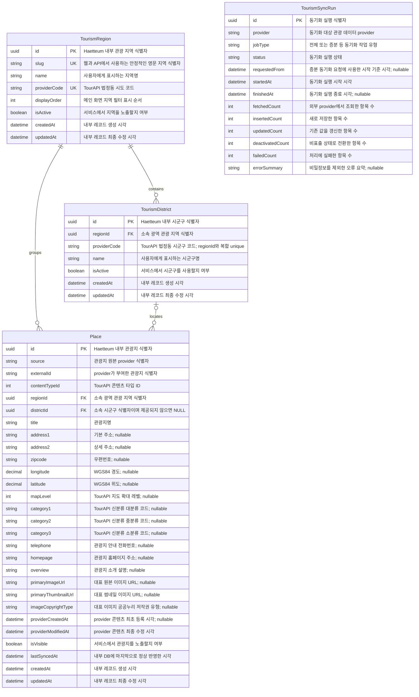
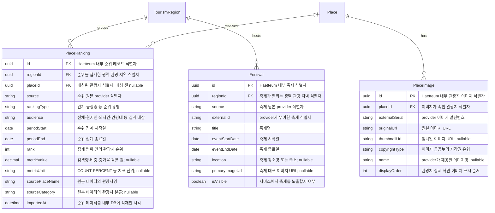

# Haetteum 관광 데이터 ERD

**상태:** Active
**마지막 검증:** 2026-08-24
**구현 기준:** `20260824135934_scope_tourism_district_provider_code`

이 문서는 Haetteum 관광 데이터베이스의 관계와 구현 상태를 빠르게 확인하기 위한
ERD 기준 문서다. 데이터베이스 변경 시 Prisma schema, migration과 이 문서를 같은
작업에서 갱신한다.

## 기준 파일

- [Prisma schema](../apps/api/prisma/schema.prisma)
- [첫 관광 데이터 migration](../apps/api/prisma/migrations/20260821000000_add_tourism_place_foundation/migration.sql)
- [테이블·컬럼 comment migration](../apps/api/prisma/migrations/20260822000000_add_tourism_database_comments/migration.sql)
- [시군구 지역 범위 unique migration](../apps/api/prisma/migrations/20260824135934_scope_tourism_district_provider_code/migration.sql)
- [관광지 데이터베이스 설계](superpowers/specs/2026-08-21-tourism-place-database-design.md)

## 상태 구분

| 상태 | 의미 |
|---|---|
| ✅ 구현됨 | Prisma model과 적용 가능한 migration이 존재한다. |
| 🧭 확장 예정 | 설계 방향만 있으며 아직 Prisma model이나 migration이 없다. |

## 1. 현재 구현 ERD

아래 네 entity만 현재 데이터베이스에 구현되어 있다.

| Entity | DB table | Table comment |
|---|---|---|
| `TourismRegion` | `tourism_regions` | Haetteum 서비스에서 노출하는 광역 관광 지역 |
| `TourismDistrict` | `tourism_districts` | TourAPI 법정동 시군구 코드와 광역 관광 지역의 관계 |
| `Place` | `places` | TourAPI에서 동기화한 관광지 기본 정보 |
| `TourismSyncRun` | `tourism_sync_runs` | 관광 데이터 전체 또는 증분 동기화 실행 이력 |

### 현재 관계와 제약

| 관계·제약 | 현재 동작 |
|---|---|
| `TourismRegion 1:N TourismDistrict` | 지역을 삭제할 때 소속 시군구가 있으면 삭제를 거부한다. |
| `TourismDistrict (regionId, providerCode)` | TourAPI 시군구 코드는 시도 내부 코드이므로 지역과 함께 복합 unique로 식별한다. |
| `TourismRegion 1:N Place` | 지역을 삭제할 때 소속 관광지가 있으면 삭제를 거부한다. |
| `TourismDistrict 0..1:N Place` | 관광지는 시군구 없이 저장할 수 있다. 시군구가 삭제되면 `districtId`는 `null`이 된다. |
| `Place (source, externalId)` | 같은 provider 관광지의 중복 저장을 거부하는 복합 unique 제약이다. |
| `Place isVisible` | TourAPI 비표출은 물리 삭제가 아니라 `false`로 보존한다. |
| `TourismSyncRun` | 현재 다른 테이블을 참조하는 FK가 없는 독립 실행 이력이다. |

### 현재 기준 지역

| slug | 표시명 | TourAPI 법정동 시도 코드 |
|---|---|---|
| `seoul` | 서울 | `11` |
| `gyeonggi` | 경기 | `41` |
| `gangwon` | 강원 | `51` |
| `busan` | 부산 | `26` |
| `jeju` | 제주 | `50` |

### 실 동기화 현황

2026-08-24에 TourAPI 전체 동기화를 연속 두 번 실행하고 증분 동기화를 한 번
실행했다. 두 번째 전체 동기화의 신규 행은 0건이었고 관광지 UUID는
보존됐다. 같은 KST 날짜의 증분 동기화는 변경 0건으로 성공했다.

| 지역 | 시군구 | 표출 관광지 |
|---|---:|---:|
| 서울 | 25 | 781 |
| 경기 | 55 | 1,555 |
| 강원 | 18 | 1,351 |
| 부산 | 16 | 352 |
| 제주 | 2 | 563 |
| **합계** | **116** | **4,602** |

동기화 후 `(source, externalId)` 중복, 잘못된 지역 FK, 서로 다른 지역의
`Place`와 `TourismDistrict` 연결, `contentTypeId != 12`, 빈 제목은 모두 0건으로
확인했다. 인기순위·평점·후기 수는 이 ERD의 현재 구현 엔티티에 포함되지
않는다.

## 2. 확장 예정 ERD

아래 entity와 관계는 구현 방향을 확인하기 위한 논리 ERD이며, 현재 Prisma schema와
데이터베이스에는 존재하지 않는다.

| Entity | 예정 table | Table comment |
|---|---|---|
| `PlaceRanking` | `place_rankings` | 기간·지역·대상별 관광지 순위와 원본 지표 |
| `PlaceImage` | `place_images` | 관광지별 복수 이미지와 저작권 정보 |
| `Festival` | `festivals` | TourAPI 행사·축제 기간과 노출 정보 |

### 확장 시 확인할 결정

- `PlaceRanking.placeId`는 데이터랩 원본과 TourAPI 관광지 매칭 전까지 nullable로
  유지한다.
- `PlaceImage`는 복수 이미지가 필요한 상세 화면 범위에서 추가한다.
- `Festival`은 행사 기간을 가지므로 `Place`에 합치지 않고 별도 생명주기로 관리한다.
- 후기 평점과 후기 수는 관광지 원본 데이터가 아니므로 후기 도메인에서 별도로
  집계한다.

## 3. ERD 갱신 규칙

1. Prisma model이나 관계를 변경하면 같은 변경에서 현재 구현 ERD를 갱신한다.
2. migration을 추가하면 문서 상단의 구현 기준과 마지막 검증일을 갱신한다.
3. 구현되지 않은 entity는 현재 구현 ERD에 넣지 않는다.
4. relation의 `onDelete`, nullable 여부와 unique 제약을 반드시 문서에 반영한다.
5. `prisma validate`, migration drift 검사와 실제 DB 관계 테스트 후 문서 상태를
   최신으로 표시한다.
