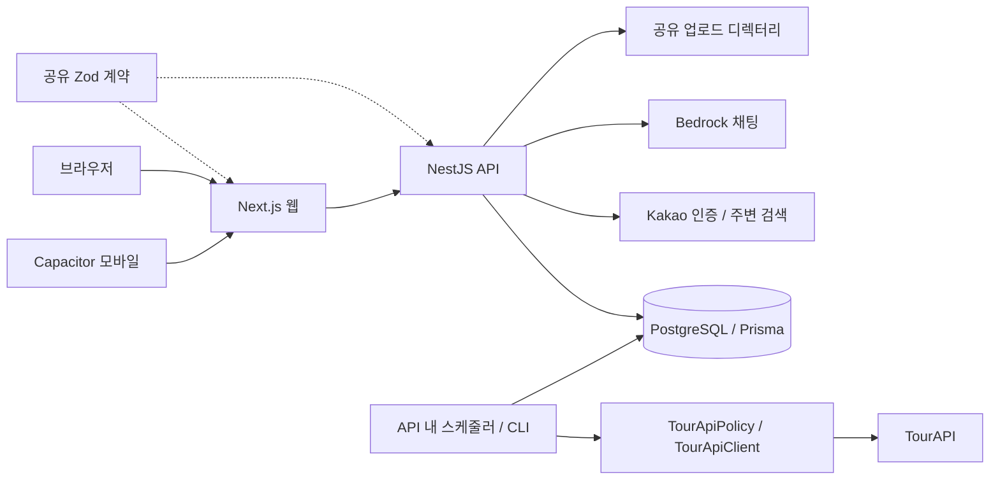

# 전체 아키텍처·코드 리뷰 — 2026-09-14

현재 작업 트리를 기준으로 웹·API·공유 계약·모바일 설정·배포·테스트를 검토했다. 제품 코드는 수정하지 않았다. 운영 DB, 실제 TourAPI, 운영 배포는 실행하지 않았다. 전체 파일의 모든 분기를 검증한 보안 감사는 아니며 주요 실행 경계와 사용자 흐름을 중심으로 검토했다.

## 평가

현재 규모에는 **모노레포와 모듈형 모놀리스 구조를 유지하는 것이 적절하다.** 웹/API/공유 계약의 소유권이 명확하고, 관광 데이터 수집과 사용자 조회를 분리한 방향이 좋다. 전면 재작성이나 마이크로서비스 전환보다 업로드 소유권, 사용자별 캐시, 배치 재개 기능을 먼저 보완해야 한다.

현재 생성 코스는 DB 장소와 Kakao 주변 검색을 조합하는 경로이며, Bedrock 채팅과 별개다. 오래된 ARCHITECTURE.md에는 AI·일정 저장·배포가 미구현으로 남아 있어 현재 코드와 차이가 있다.

### 유지할 장점

- `packages/contracts`가 HTTP 계약을 소유하고 Prisma 타입은 API 내부에 둔다.
- 세션 원문 대신 해시를 저장하며 주요 개인 데이터 쿼리에 `userId`를 적용한다.
- TourAPI 요청에 배치 문맥, DB advisory lock, 영속 호출 예산이 적용된다. 조사한 사용자 조회 경로에서 TourAPI 폴백은 발견하지 못했다.
- 배포 아티팩트를 격리해 실행하고, 백업·체크섬·이전 릴리스 복귀를 준비하는 코드가 있다.
- 단위 테스트가 넓게 존재한다. 다만 아래 실패 시나리오는 현재 테스트가 놓치고 있다.

## 확인된 코드 문제

P1은 우선 수정할 보안·데이터 손실·운영 중단 위험, P2는 이어서 수정할 정확성·신뢰성 문제다. 운영 장애가 실제 발생했다는 의미는 아니다.

### 1. P1 — 이미지 업로드가 HTML 파일을 허용한다

- 근거: [review-images.controller.ts](../apps/api/src/reviews/review-images.controller.ts#L38), [profile.controller.ts](../apps/api/src/profile/profile.controller.ts#L66), [main.ts](../apps/api/src/main.ts#L20).
- `originalname`의 확장자를 그대로 저장하고 클라이언트가 제공한 MIME만 검사한다. HTML 내용과 `.html` 파일명을 `image/jpeg`로 제출하면 통과한다.
- 임시 환경에서 실제 컨트롤러 설정을 실행해 `accepted=true`, 저장 확장자 `.html`을 확인했다. 브라우저 실행 자체는 시험하지 않았지만 정적 제공 경로에서 HTML로 제공될 수 있는 구조다. 인증된 업로더가 만든 링크를 열었을 때 신뢰받는 API 출처에서 스크립트가 실행되는 위험이 있다.
- 수정: 실제 이미지 디코딩과 재인코딩, 서버가 결정한 확장자, 크기·픽셀 제한, 고정된 공개 업로드 URL. 업로드 경계는 리뷰와 프로필이 공유하도록 한다.
- 검증: MIME 위장 HTML·손상 이미지 거부, 정상 JPEG/PNG/WebP 허용, 저장 결과가 서버 지정 이미지 형식인지 확인.

### 2. P1 — 후기 내용만 수정해도 유지한 사진을 삭제한다

- 근거: [reviews.service.ts](../apps/api/src/reviews/reviews.service.ts#L234).
- 새 이미지 목록에 포함된 URL도 기존 이미지라는 이유로 전부 삭제한다. 편집 화면은 기존 URL을 유지해 제출하므로 일반적인 텍스트 수정으로 발생한다.
- 실제 서비스와 임시 파일로 `응답에는 URL 유지`, `파일은 삭제`를 확인했다.
- 수정: DB 업데이트 성공 후 `이전 이미지 − 유지 이미지`만 정리한다. 이후 업로드 ID 기반으로 전환하고 연결이 남은 파일은 삭제하지 않는다.
- 검증: `[A,B] → [B,C]` 수정에서 A만 삭제, B 유지, DB 실패 시 파일 유지.

### 3. P1 — 로그아웃·이메일 계정 전환 시 개인 캐시가 섞인다

- 근거: [my-page-menu-list.tsx](../apps/web/src/components/travel/my-page-menu-list.tsx#L43), [favorite-place-query.ts](../apps/web/src/features/places/favorite-place-query.ts), [saved-course-query.ts](../apps/web/src/features/trips/saved-course-query.ts).
- 로그아웃은 인증 store만 초기화한다. 유지되는 QueryClient에 사용자 구분 없는 `favorites/mine`, `saved-courses/mine` 캐시가 남는다. 같은 SPA 세션에서 다른 계정으로 로그인하면 이전 계정 데이터가 표시될 수 있다.
- 설치된 QueryObserver로 A 캐시와 B의 `initialData`를 함께 공급했을 때 A 데이터가 반환됨을 확인했다. 전체 브라우저 계정 전환 E2E는 실행하지 않았다.
- 수정: 개인 query key에 사용자 ID를 포함하고 인증 전환 때 진행 요청 취소 및 개인 캐시 제거. anonymous 상태의 찜 표시도 이전 캐시를 반환하지 않게 한다.
- 검증: A → 로그아웃 → 이메일 B 로그인 시 모든 개인 화면에서 A 데이터가 나타나지 않아야 한다. 늦은 A 응답도 B 캐시를 오염시키지 않아야 한다.

### 4. P1 — TourAPI 본문 수신이 요청 타임아웃 밖에 있다

- 근거: [tour-api.client.ts](../apps/api/src/tourism/tour-api.client.ts#L397), [타이머 해제](../apps/api/src/tourism/tour-api.client.ts#L459), [정책 lock](../apps/api/src/tourism/tour-api-policy.ts#L106).
- `fetch()`가 헤더를 반환하면 타이머를 해제하고 그 뒤에 `response.text()`를 기다린다. 본문이 중단되거나 계속 지연되는 경우 애플리케이션의 제한 시간이 적용되지 않는다. 그동안 요청·배치 lock을 보유해 다른 수집도 지연된다.
- 수정: 본문 소비까지 하나의 abort 수명 안에 포함하고 성공·오류 응답 모두 적용한다. 응답 바이트 한도도 둔다.
- 검증: 헤더는 즉시 반환하지만 본문은 끝나지 않는 mock stream을 시간 제한으로 종료하고 다음 배치가 lock을 획득하는지 확인.

### 5. P1 — 한도 초과한 목록 수집을 다음 날 이어갈 수 없다

- 근거: [tourism-sync.service.ts](../apps/api/src/tourism/tourism-sync.service.ts#L144), [전체 완료 후 체크포인트](../apps/api/src/tourism/tourism-sync.service.ts#L181).
- 성공한 실행만 다음 시작점으로 삼고 날짜×지역×노출 상태를 모두 처리한 뒤 체크포인트를 저장한다. 17개 지역, 두 노출 상태, 30일이면 빈 목록이어도 최소 1,020회로 기본 일일 한도 1,000회를 넘는다. 다음 날 이전 날짜부터 재시도해 진척을 보존하지 못하고 30일 제한에 걸릴 수 있다.
- 수정: 고정된 수집 범위와 날짜·지역·노출 상태·페이지 진행 상태를 DB에 영속화한다. 처리된 데이터와 페이지 완료 상태를 함께 커밋하고 중단 지점부터 재개한다. 페이지 경계가 변하는 공급자라면 경계 재조회·upsert 정책도 명시한다.
- 검증: 30일×17지역×2상태, 첫날 예산 소진, 프로세스 재시작, 다음 날 완료 시나리오. showflag·날짜·지역 필터를 임의로 제거하면 안 된다.

### 6. P2 — 다른 사용자 업로드 파일을 삭제할 수 있다

- 근거: [리뷰 생성](../apps/api/src/reviews/reviews.service.ts#L175), [파일 삭제](../apps/api/src/reviews/reviews.service.ts#L253), [URL 입력 계약](../packages/contracts/src/reviews.ts#L9).
- 입력 URL의 소유권 기록이 없고 `/uploads/reviews/` 뒤 파일명을 삭제 대상으로 삼는다. 타인의 URL을 아는 사용자가 자신의 후기에 연결한 뒤 후기를 삭제하면 타인 파일도 삭제된다.
- 실제 서비스와 임시 파일로 해당 파일 삭제를 재현했다.
- 수정: `UploadedAsset(ownerId, storageKey, contentType, status)`를 도입해 업로드 ID를 연결하고 소유권을 검사한다. URL 문자열을 파일 삭제 권한으로 사용하지 않는다. 항목 1·2와 같은 개선 묶음으로 먼저 처리할 것을 권장한다.
- 검증: A 업로드를 B가 생성·수정에 연결할 수 없고 B의 후기 삭제가 A 파일을 제거하지 않아야 한다.

### 7. P2 — 늦은 코스 생성 결과가 최신 선택·초기화를 덮어쓴다

- 근거: [course-editor.tsx](../apps/web/src/features/courses/course-editor.tsx#L153).
- 요청별 식별 없이 응답마다 draft와 `generating`을 갱신한다. A 생성 중 B 선택 후 B→A 순으로 완료되면 A 결과가 남는다. 초기화 후 늦은 응답도 다시 draft를 채운다.
- 수정: 요청 세대 번호와 취소를 적용하고 최신 응답만 상태에 반영한다. 초기화·화면 이탈은 진행 요청을 무효화한다.
- 검증: 역순 응답, 생성 중 초기화, 실패 후 재시도, pending 중 저장 상태.

### 8. P2 — 비노출 장소의 코스 조회가 허용된다

- 근거: [place-courses.service.ts](../apps/api/src/place-courses/place-courses.service.ts#L60).
- 장소 ID 존재 여부만 검사하고 `isVisible`을 검사하지 않는다. 다른 장소 상세 API와 달리 비노출 처리 후에도 코스 조회가 가능하다. 경유지 스냅샷의 노출 정책도 함께 정의해야 한다.
- 수정: 요청 기준 장소는 `isVisible=true`로 제한한다. 비노출 연결 경유지는 공개 상세 링크·정보를 제거하거나 코스 공개 대상에서 제외하는 정책을 명시한다.
- 검증: 비노출 기준 장소는 404, 정상 장소는 기존 응답 유지, 비노출 경유지가 공개 정보로 재등장하지 않음.

### 9. P2 — TTL 캐시의 오래된 키가 자동으로 제거되지 않는다

- 근거: [ttl-cache.ts](../apps/api/src/common/cache/ttl-cache.ts#L9).
- 같은 키를 다시 읽을 때만 삭제하므로 다시 조회되지 않는 만료 응답은 Map에 남는다. 주변 장소·코스의 조회된 고유 키 수만큼 메모리가 누적된다. 실제 OOM 발생은 측정하지 않았다.
- 수정: 최대 엔트리 수를 가진 LRU와 만료 정리를 적용한다. 당장 Redis 도입은 필요하지 않다.
- 검증: 최대 용량 초과 시 축출, 시간 경과 후 정리, 유효 엔트리 반환.

### 10. P2 — 배포 후보 웹이 후보 API를 사용하도록 강제하지 않는다

- 근거: [activate-release.sh](../scripts/deploy/activate-release.sh#L97), [api-base.ts](../apps/web/src/lib/api-base.ts#L20).
- 후보 API는 4001 포트인데 후보 웹은 공유 `web.env`를 그대로 읽는다. 이 파일이 운영 API 4000을 가리키면 후보 SSR은 이전 API와 통신한다. 현재 smoke는 후보 API health와 웹 화면을 각각 확인하므로 새 웹·새 API 간 호환성 검증을 놓칠 수 있다. 실제 운영 env 값은 확인하지 않았다.
- 수정: 후보 프로세스에 `API_BASE_URL=http://127.0.0.1:4001/api/v1`을 명시하고 웹→후보 API 응답을 확인하는 smoke를 추가한다. 브라우저 공개 URL 검증은 별도 staging origin에서 수행한다.
- 검증: 운영/후보 API가 서로 다른 sentinel 값을 반환하게 하고 후보 웹이 후보 값을 사용함을 확인.

## 아키텍처 개선 권고

아래는 확인된 버그와 구분되는 구조적 제안이다.

| 영역 | 제안 | 목적·완료 기준 |
|---|---|---|
| 모듈 경계 | API 요청 프로세스와 배치 실행 진입점을 분리하고 동일 도메인 서비스를 재사용 | HTTP 인스턴스를 늘려도 배치가 중복 실행되지 않고 배치 부하·재시작을 독립 관리. TourAPI DB lock·예산은 유지 |
| 미디어 | 공통 Asset 서비스에 업로드 검증·소유권·연결·정리를 모음 | 리뷰/프로필 중복 제거, 임시 업로드 만료 정리, DB와 파일 정합성 확보. 다중 서버가 필요할 때 객체 저장소 전환 |
| 서버 상태 | 사용자 키를 포함한 query key factory와 인증 전환 cleanup을 한곳에 둠 | 화면별로 로그아웃 정리 누락 방지 |
| 조회 규모 | 후기 목록 pagination, 상세 미완료 버전의 SQL 필터와 keyset pagination | `listForPlace` 전체 반환 및 `enrichPendingPlaceDetails` 전체 로딩을 제한. 대표 데이터에서 EXPLAIN과 응답 크기로 확인 |
| 서비스 분해 | 887행 TourismSyncService를 목록 순회·상세 수집·실행 상태 저장으로 나눔 | 각 책임의 실패/재개를 독립 테스트. 단순히 파일 크기만 줄이기 위한 분해는 피함 |
| 관측성 | 요청 ID에 연결한 안전한 오류 원인, 배치 진척/지연/예산, 채팅 지연/실패율 계측 | 비밀키·개인 대화는 기록하지 않으면서 실패 원인을 찾을 수 있음. 현재 오류 필터는 원인을 매우 제한적으로 기록 |
| 인증 | 이메일 로그인 계정/IP별 제한을 공유 저장소 또는 확인 가능한 edge 정책으로 보장 | 저장소 내 제한은 발견하지 못함. 외부 프록시 정책은 미확인하므로 실제 미보호로 단정하지 않음 |
| CI | PR에서도 lint/unit/build 실행, 격리 DB e2e를 병합 조건에 포함 | 현재 workflow는 main 등 push와 수동 실행이며 lint/API e2e 명령을 포함하지 않음. 패키지 smoke와 단위 테스트는 있음 |
| 문서 | ARCHITECTURE.md, README, ERD의 구현 상태 동기화 | 전국 17지역, 이메일 인증, 저장 코스, 채팅, 배포, TourAPI 정책이 코드와 일치 |

## 검증 결과와 한계

- `pnpm test`: 공유 계약 43개, 웹 683개, API 619개, **총 1,345개 통과**.
- 최초 샌드박스 실행에서 API 2개가 포트 바인딩 EPERM으로 실패했다. 포트 사용을 허용해 재실행했을 때 모두 통과했다.
- `pnpm lint`: 오류 0, 웹 경고 3개(미사용 선언 2개, 불필요한 eslint-disable 1개).
- 업로드·후기 삭제 3개 문제는 현재 TS를 메모리에서 변환하고 mock DB 및 실제 임시 파일로 재현했다. 스크립트: `/tmp/haetteum-review-repro.cjs`.
- 개인 캐시 문제는 설치된 QueryObserver 동작으로 확인했다. 나머지 결함은 실행 흐름과 설정의 정적 분석이다.
- 프로덕션 빌드, DB e2e, 브라우저 전체 흐름, 실제 운영 데이터의 쿼리 성능은 이번에 검증하지 않았다. 단위 테스트 통과는 위 결함이 없다는 의미가 아니다.

구현 순서와 작업별 검증 기준은 [개선 계획](superpowers/plans/2026-09-14-architecture-improvements.md)을 참고한다.
