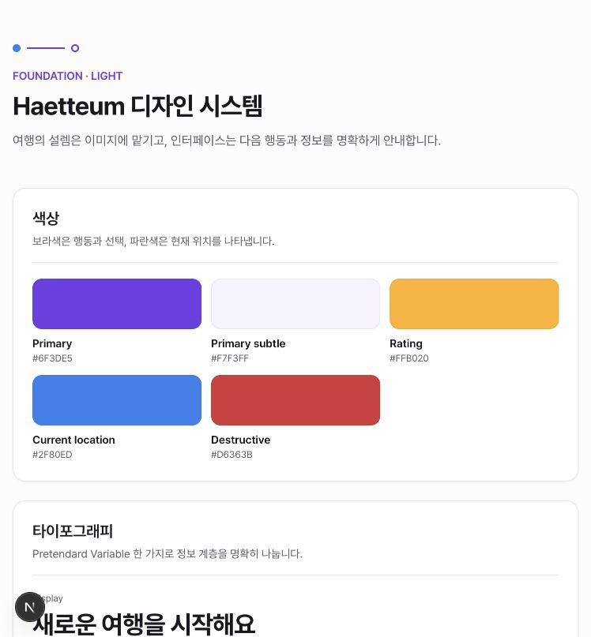
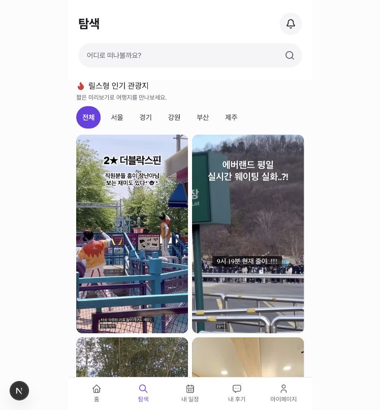
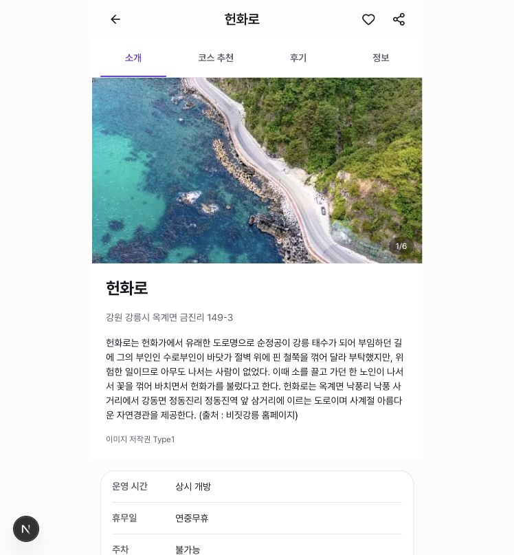
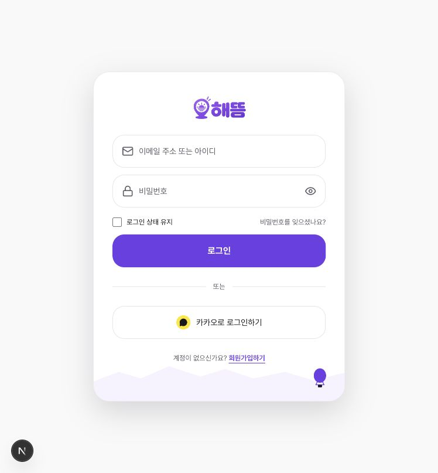

# 디자인 시스템 적용 조사 — 2026-09-14

판정: 기반은 실제로 사용되고 있으나, 화면 확장 과정에서 타이포그래피·모서리·오버레이·터치 영역 규칙이 분산되어 있다. 디자인 시스템이 없는 상태는 아니며, 기존 토큰과 컴포넌트로 수렴시키는 작업이 필요하다.

## 범위와 방법

- 기준: `DESIGN.md`, `src/styles/tokens.css`, `typography.css`, `components/ui`, 개발용 `/design-system`.
- 정적 집계: `apps/web/src/**/*.tsx` 중 `components/ui`, `components/design-system`을 제외한 173개 파일. 문자열 패턴 출현 수이며 실제 렌더링 횟수나 준수율이 아니다. 숨겨진 화면·mock 경로도 포함된다.
- 시각 확인: 실행 중인 localhost:3010에서 아래 4개 화면의 현재 뷰포트를 캡처하고 저장 파일을 재확인했다. 전체 페이지 및 모든 반응형 폭을 검사하지 않았다.
- 제품 소스는 변경하지 않았다. 조사 보고서와 캡처만 추가했다.

## 사용 현황

| 항목 | 출현 수 | 파일 수 | 해석 |
|---|---:|---:|---|
| `type-*` 역할 클래스 | 388 | 111 | 역할 기반 타이포그래피가 폭넓게 사용됨 |
| `text-[숫자…]` 임의 글자 크기 | 53 | 27 | 역할 체계 밖의 크기가 적지 않음 |
| 임의 radius | 25 | 19 | 동일값의 토큰 우회와 신규값이 섞임 |
| 임의 shadow | 3 | 3 | 일정 카드 등에서 별도 그림자 정의 |
| 공통 `Button` JSX | 34 | 15 | 재사용 중 |
| 네이티브 `button` JSX | 51 | 36 | 개별 검토 대상. 모든 네이티브 버튼이 위반은 아님 |
| 공통 `Input` JSX | 3 | 3 | 전용 입력 패턴과 함께 사용됨 |
| 네이티브 `input` JSX | 11 | 8 | checkbox/file 등 용도가 달라 단순 전환율로 해석하면 안 됨 |
| UI 계층 밖 Base UI 직접 import | 8 | 8 | Dialog/Menu의 공통 스타일 경계 부족 |
| motion 변수 참조 | 3 | 3 | 고정 duration 14건/10파일에 비해 적음 |

## 잘 적용된 부분

- `tokens.css`가 primitive → semantic → Tailwind theme 연결을 소유하고 `globals.css`에서 통합한다. 색상 교체가 가능한 기반이 있다.
- Pretendard를 자체 제공하고 제목·본문·캡션 역할이 정의되어 있다.
- 공통 Button은 기본 44px, 큰 버튼 52px, focus-visible, disabled, destructive 상태를 제공한다.
- 탐색의 활성 필터와 하단 메뉴, 장소 상세의 선택 탭이 보라색을 행동/선택의 의미로 사용한다. 상세 탭은 밑줄을 함께 사용한다.
- 밝은 surface, 사진 중심 콘텐츠, 제한된 앱 폭이 대표 화면에서 유지된다.
- 전역 reduced-motion 처리와 safe-area 스타일이 존재한다. 기기별 실제 동작은 이번 조사에서 검증하지 않았다.
- Foundation 및 preview 테스트 12개 통과. 이 결과는 제품 전체 접근성 보장을 뜻하지 않는다.

## 주요 발견

### 1. 우선 — 44px 터치 영역 규칙이 실제 컨트롤에서 깨짐

`review-moderation-actions.tsx:62`, `my-review-card.tsx:49`는 메뉴 버튼을 `size-8`(32px)로 구성한다. `saved-course-route-map.tsx:150`, `place-search-dialog.tsx:93`의 닫기 버튼은 `size-9`(36px)이다. 지도 이동 버튼도 `live-generated-course-map.tsx:108`에서 32px이다.

아이콘 크기와 터치 영역을 분리하고 컨트롤 박스를 최소 44px로 맞춰야 한다. 이는 DESIGN.md의 제품 기준 위반이며, 별도의 WCAG 적합성 판정은 아니다. 로그인 필요 화면의 메뉴는 코드로 확인했으며 실제 열린 상태를 캡처하지 않았다.

### 2. 중간 — 타이포그래피가 화면별로 세분화됨

`festival-discovery-list-item.tsx:51` 날짜는 0.65rem(기본 16px 기준 10.4px), 58행 분류는 0.62rem(9.92px)이다. 문서의 caption은 12px이다. `profile-summary-card`, `trip-schedule-card`, `my-review-card` 등도 0.78/0.8/0.82/1.05/1.08/1.3rem을 별도로 사용한다.

27파일의 임의 글자 크기 53건을 역할별로 검토해 기존 type 클래스로 합치고, 반복적으로 꼭 필요한 크기만 문서화된 역할로 승격하는 편이 적절하다. 순위 숫자 같은 display 크기까지 일괄 제거할 필요는 없다. 작은 축제 텍스트의 가독성은 코드상 위험으로, 해당 축제 목록의 실기기 가독성은 미검증이다.

### 3. 중간 — 카드·Dialog·Menu 스타일 중복

공통 Card는 16px, Dialog 규칙은 20px인데 제품에서는 1.1/1.125/1.15/1.35/1.5/1.75rem 등이 쓰인다. 1.75rem은 7회, 1.15rem은 5회 반복된다. 1rem처럼 이미 토큰과 같은 값도 직접 지정된다.

`saved-course-card.tsx:36`, `trip-schedule-card.tsx:17`에는 같은 별도 그림자가 반복된다. `random-course-dialog`, `course-place-detail-modal`, `saved-course-route-map`에는 backdrop·28px popup radius·transition 조합이 중복된다.

`components/ui`에는 Dialog/Menu wrapper가 없고, UI 밖에서 Base UI를 직접 import하는 파일이 8개다. 특히 `features/courses/course-alternative-dialog.tsx:3`은 문서의 feature/page 직접 import 금지에 해당한다. 공통 Dialog/Menu를 만든 뒤 필요한 크기만 variant로 표현하면 변경 지점을 줄일 수 있다. Base UI 접근성 기능을 쓴다는 사실 자체는 긍정적이다.

### 4. 중간 — 시스템 정의와 제품/미리보기가 함께 갱신되지 않음

DESIGN.md 67–68행은 소개·코스·정보 탭을 준비 중으로 설명하지만 현재 소개는 실제로 동작한다. 문서의 `muted → neutral-25`와 구현의 `muted → neutral-100`도 다르다.

미리보기는 Foundation과 일부 여행 콘텐츠에 집중되어 있고 실제 Dialog/Menu, Select/Switch의 상태를 보여주지 않는다. 자체 후기만 사용한다는 문서와 달리 미리보기에는 외부 후기 출처 예제가 남아 있다. 현재 승인된 제품 상태로 문서와 예시를 맞추고 오버레이·오류·빈 상태를 추가할 필요가 있다.

### 5. 중간 — 이탈을 막는 자동 검사가 부족함

ESLint는 Next/TypeScript 기본 규칙이며 토큰 우회·Base UI import 경계를 강제하는 규칙이 없다. preview axe 테스트는 `color-contrast`를 비활성화한다. 테스트 통과만으로 색 대비, 터치 크기, 브라우저 레이아웃을 보장할 수 없다.

문서화한 예외를 허용하는 방식으로 import 경계 검사부터 추가하고, 대표 화면의 작은 텍스트·컨트롤 크기·시각 회귀를 실제 브라우저에서 점검하는 것이 유용하다.

## 예외로 분리할 항목

Google/Kakao 로고의 고유색, 외부 영상 자체의 자막, 지도 SDK의 fallback 색상은 일반 UI의 토큰 우회와 동일하게 집계하면 안 된다. 지도 fallback은 실제 `--route-line` 참조 여부와 함께 검토해야 한다. 임의 크기의 이미지 레이아웃 역시 모두 디자인 시스템 위반은 아니다.

## 캡처 단계와 상태

1. Foundation `/design-system` — 기준 화면 정상. 색상·서체 설명 확인. 캡처는 화면 상단만 포함한다.
2. 탐색 `/explore` — 선택색·앱 폭·하단 내비게이션 일관성 양호. 영상 자막은 서비스의 타이포그래피와 구분한다.
3. 헌화로 상세 소개 — 선택 탭·본문·정보 카드의 기본 체계 양호. 첫 화면에서 줄바꿈과 주요 정보 확인.
4. 마이페이지 진입 → 로그인 — 로그인이 필요해 마이페이지 확인은 제한됨. 로그인 화면의 브랜드색은 일관되나 큰 radius·그림자는 다른 앱 화면과 차이가 있으므로 승인된 인증 화면 예외인지 문서화가 필요하다.

## 권장 진행 순서

1. 32/36px 메뉴·닫기·지도 버튼의 터치 박스를 44px로 보완.
2. Dialog/Menu 공통 컴포넌트와 카드 variant로 반복 스타일 통합.
3. 10px 전후 보조 텍스트 및 임의 크기를 type 역할로 정리.
4. DESIGN.md와 `/design-system`을 실제 제품 기준으로 갱신.
5. import 경계 검사와 320/390/768px 중심의 브라우저 시각 검증 추가.

## 검증 한계

로그인 이후 화면, 모든 breakpoint, 실제 터치 기기, 스크린리더, 동적 오류 상태, 명도 대비 비율은 검증하지 않았다. 스크린샷에 없는 문제는 코드 근거로 명시했다. 별도 Figma 원본과 비교하지 않았으며 현재 저장소의 활성 DESIGN.md를 기준으로 판단했다. 원본 변경 시각만으로 어느 화면이 최근 추가됐는지는 단정하지 않는다.
