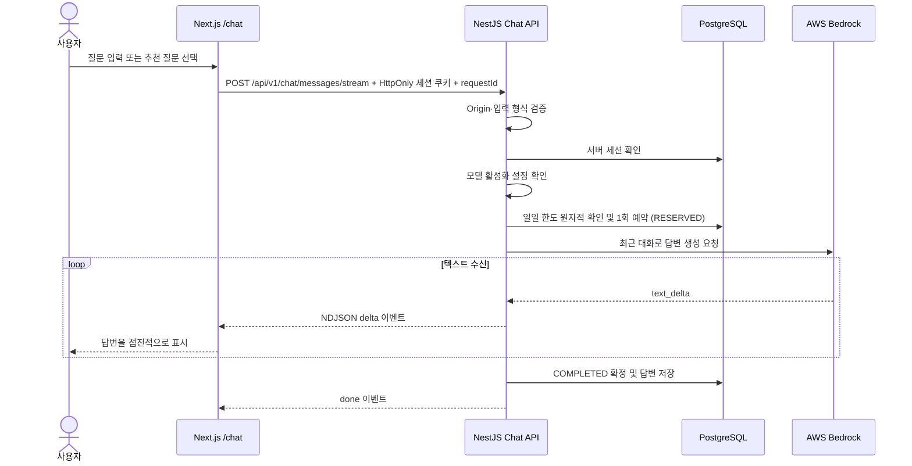

# 챗봇 동작 구조

이 문서는 2026-09-12 작업 디렉터리의 구현을 기준으로 해뜸 챗봇의 요청·응답 흐름을 설명한다. 운영 환경의 실제 설정이나 AWS 호출 성공 여부를 검증한 문서는 아니다.

## 전체 구조

해뜸 여행 도우미는 로그인한 사용자의 질문과 최근 대화를 NestJS API로 보내고, API가 AWS Bedrock의 Claude 모델을 호출해 생성된 텍스트를 브라우저로 전달하는 챗봇이다. 브라우저는 답변을 조금씩 받아 Markdown으로 표시한다.

현재 챗봇 호출에는 별도의 시스템 프롬프트, 관광 DB 조회, TourAPI·웹 검색, RAG(검색한 자료를 모델에 제공하는 방식), 도구 호출이 없다. 여행 도우미라는 화면 문구와 추천 질문은 UI에 있으며 모델에 별도 지침으로 전달되지 않는다. 따라서 답변은 전달한 대화와 모델의 지식에 기반하고, 서비스의 관광지·축제 데이터나 최신 영업 정보를 확인한 결과는 아니다.



오류나 한도 초과가 발생하면 해당 단계에서 중단한다. 위 다이어그램은 정상 스트리밍 경로다.

## 1. 화면 진입과 질문 전송

- `/chat`의 서버 레이아웃이 `requireCurrentUser("/chat")`로 로그인 여부를 확인한다. 비로그인은 `/login?returnTo=%2Fchat`으로 이동한다.
- 처음에는 추천 질문 3개를 보여준다. 추천 질문을 누르면 일반 입력과 같은 경로로 전송한다.
- 질문의 앞뒤 공백을 제거하고 빈 질문과 2,000자 초과 질문을 차단한다. Enter는 전송, Shift+Enter는 줄바꿈이며 한글 조합 중 Enter는 전송하지 않는다.
- 요청 중에는 중복 전송을 차단한다. 사용자의 질문은 API 응답을 기다리기 전에 화면에 추가한다.
- `NEXT_PUBLIC_API_BASE_URL`에 `/chat/messages/stream`을 붙여 POST한다. `credentials: "include"`로 세션 쿠키를 포함한다. base URL이 없으면 사용 불가 오류를 표시한다.

구현: [페이지](../apps/web/src/app/chat/page.tsx), [로그인 보호 레이아웃](../apps/web/src/app/chat/layout.tsx).

## 2. 대화 문맥과 보관 방식

화면의 대화는 React `useState`에 저장한다. 완료 답변은 requestId 중복 처리용으로 서버 DB에 보관하지만, 전체 대화 내역을 localStorage에 저장하거나 화면에 복원하는 기능은 없다. 새로고침하거나 페이지를 떠났다가 다시 진입하면 이전 대화를 복원하지 않는다.

후속 질문을 보낼 때 브라우저가 이전 질문·답변을 요청에 포함한다. 서버가 대화 ID로 과거 기록을 찾아오는 방식이 아니다.

| 항목 | 현재 제한 |
| --- | --- |
| 사용자 질문 | 메시지당 최대 2,000자 |
| API 수신 메시지 | 1~101개, 홀수 개 |
| 메시지 순서 | `user`, `assistant`가 번갈아 나오며 `user`로 시작하고 끝남 |
| 개별 메시지 내용 | trim 후 비어 있지 않아야 하며 최대 12,000자; user는 2,000자 제한 추가 |
| 모델에 보내는 문맥 | 최근 질문·답변 4쌍 + 현재 질문, 최대 9개 |
| 모델 입력 문맥의 전체 길이 | 최대 12,000자 |

`selectChatContext()`가 최근 9개 메시지를 고른 뒤 전체 길이가 12,000자를 넘으면 가장 오래된 질문·답변 쌍부터 제거한다. 현재 질문은 유지한다. 예를 들어 5쌍의 대화 후 새 질문을 보내면 가장 오래된 1쌍은 모델 입력에서 제외되지만 화면에는 남는다.

브라우저와 서버가 모두 이 함수를 적용하므로 직접 API를 호출해도 서버의 문맥 제한을 받는다. 코드의 문자 수는 JavaScript 문자열 `length` 기준이며 모델의 토큰 수와 다르다.

구현: [공유 요청 스키마와 문맥 선택](../packages/contracts/src/chat.ts), [ChatService](../apps/api/src/chat/chat.service.ts).

## 3. 접근 제어와 사용량

서버는 다음 순서로 요청을 처리한다.

1. `SameOriginGuard`가 요청의 `Origin`이 `WEB_ORIGIN`과 같은지 검사한다. Origin이 없거나 다르면 403이다.
2. `ChatRequestPipe`가 공유 Zod 스키마로 본문을 검증한다. 잘못된 입력은 400이다.
3. `ChatAccessService`가 쿠키의 세션을 조회해 사용자를 확인한다. 유효하지 않으면 401이며 잘못된 세션 쿠키를 지운다. 필요한 경우 쿠키 만료를 갱신한다.
4. 챗봇 활성화와 리전 설정을 확인한다. 준비되지 않았다면 503이다.
5. `ChatQuotaService`가 서버에서 확인한 사용자 ID로 사용량을 예약한다. 그 후 모델을 호출한다.

사용량은 `chat_daily_usage` 테이블의 `subject_key = user:<userId>`와 한국 날짜를 기준으로 집계한다. 한 계정은 **한국 시간 하루 10회** 사용하며 여러 기기와 일반·스트리밍 API가 같은 한도를 공유한다.

PostgreSQL의 단일 `INSERT ... ON CONFLICT ... DO UPDATE ... WHERE used < 10` 문으로 처리하므로 동시 요청도 별도 조회 후 증가하는 방식의 경쟁 조건 없이 제한한다. 세션 또는 사용량 DB 오류는 503으로 처리하고 모델을 호출하지 않는다.

입력 오류·미로그인·비활성 설정·한도 초과는 차감하지 않는다. Bedrock 오류·시간 초과·빈 답변은 부분 답변을 보냈더라도 `REFUNDED`로 전환하고 원래 예약 날짜의 사용량을 1회 복구한다. 정상 완료는 `COMPLETED`와 답변을 저장한 다음 `done`을 전송한다. 사용자가 연결을 끊으면 `CANCELLED`로 기록하고 사용량은 유지한다.

웹은 새 질문마다 UUID `requestId`를 만들고 **다시 시도에는 같은 ID와 대화**를 보낸다. `chat_requests`의 `(subject_key, request_id)`로 중복을 판별한다. `RESERVED` 및 `CANCELLED` 또는 같은 ID의 다른 본문은 409로 차단한다. `COMPLETED`는 저장된 답변을 재전송하여 추가 모델 호출/차감을 막는다. `REFUNDED`만 다시 예약한다. 예약과 일별 증가, 상태 전환과 복구는 각각 DB 트랜잭션이며 실행별 `attempt_id`가 오래된 콜백의 중복 복구를 방지한다. 구형 클라이언트의 ID 없는 요청은 서버가 새 UUID를 만들므로 재시도 중복 방지는 적용되지 않는다.

날짜가 바뀌면 새 날짜 카운터를 쓴다. 매일 00:10 KST에 7일보다 오래된 종료 요청·답변과 사용량을 정리한다. 질문 본문은 저장하지 않고 비교용 SHA-256 해시만 기록한다. 완료된 답변은 중복 요청 재전송을 위해 보관한다. 정리 후에는 같은 ID라도 새 요청으로 취급된다. 프로세스 강제 종료나 DB 장애로 남은 `RESERVED`는 자동 복구하지 않고 운영 확인 대상으로 남긴다. 남은 횟수는 현재 화면에 노출하지 않는다.

구현: [접근 제어](../apps/api/src/chat/chat-access.service.ts), [사용량 서비스](../apps/api/src/chat/chat-quota.service.ts), [Origin 검사](../apps/api/src/auth/same-origin.guard.ts), [DB 모델](../apps/api/prisma/schema.prisma).

## 4. 모델 호출

`ChatService`는 `CHAT_LLM_PORT` 인터페이스를 사용하고, `ChatModule`이 이를 `BedrockChatClient`에 연결한다. 클라이언트는 `@anthropic-ai/bedrock-sdk`로 `messages.create()`를 호출한다.

| 설정 | 용도 |
| --- | --- |
| `CHAT_ENABLED` | 챗봇 활성화; 예시 환경 파일은 `false` |
| `CHAT_AWS_REGION` | Bedrock 클라이언트 리전; 활성화 시 필수 |
| `CHAT_BEDROCK_MODEL_ID` | 모델 ID 재정의; 비어 있으면 코드 기본값 사용 |
| `WEB_ORIGIN` | 챗봇 POST 요청에 허용할 Origin |
| `NEXT_PUBLIC_API_BASE_URL` | 브라우저가 호출할 API base URL |

코드 기본 모델 ID는 `global.anthropic.claude-haiku-4-5-20251001-v1:0`이며 최대 출력은 **512토큰**이다. SDK 클라이언트는 최초 모델 호출 시 생성한다. 코드에서는 `awsRegion`만 생성자에 전달하며 AWS 인증은 서버 실행 환경에서 SDK가 사용할 수 있어야 한다. 브라우저가 Bedrock을 직접 호출하지 않는다.

서버의 55초 제한은 첫 응답 대기부터 전체 스트림 종료까지 하나의 deadline으로 적용한다. 제한을 넘으면 AbortSignal로 상위 호출을 취소한다. 스트리밍 연결이 닫혀도 상위 호출을 취소한다.

구현: [Bedrock 클라이언트](../apps/api/src/chat/bedrock-chat.client.ts), [모델·시간 제한 상수](../apps/api/src/chat/chat.constants.ts), [deadline](../apps/api/src/chat/chat-deadline.ts), [환경 검증](../apps/api/src/config/environment.ts).

## 5. API와 스트리밍 프로토콜

두 endpoint는 같은 요청 형식, 접근 제어, 사용량, 문맥 제한을 사용한다.

| Endpoint | 응답 | 사용처 |
| --- | --- | --- |
| `POST /api/v1/chat/messages/stream` | 줄마다 JSON인 NDJSON 스트림 | 현재 웹 챗봇 |
| `POST /api/v1/chat/messages` | `{ "status": "ready", "reply": "..." }` | 일반 응답 API; 현재 웹에서 사용하지 않음 |

요청 예시:

```json
{
  "requestId": "1e46a70e-b7e7-4fb0-a084-8618fc690d76",
  "messages": [
    { "role": "user", "content": "서울 당일치기 코스 추천해줘" },
    { "role": "assistant", "content": "어떤 분위기의 여행을 원하시나요?" },
    { "role": "user", "content": "가족과 산책하기 좋은 곳으로 알려줘" }
  ]
}
```

정상 스트림 예시(SSE가 아닌 NDJSON):

```jsonl
{"type":"delta","text":"가족과 함께라면 "}
{"type":"delta","text":"산책 중심의 코스를 추천해요."}
{"type":"done"}
```

서버는 Bedrock의 `content_block_delta` 중 `text_delta`만 전달한다. 공백이 아닌 텍스트가 전혀 없는 응답은 502로 처리한다. 헤더는 `Content-Type: application/x-ndjson; charset=utf-8`, `Cache-Control: no-cache, no-transform`, `X-Accel-Buffering: no`를 설정한다.

첫 이벤트를 확인한 뒤 헤더를 전송하므로 시작 전 오류는 실제 HTTP 오류와 Problem Details로 보낼 수 있다. 헤더 전송 후 오류는 아래처럼 스트림 이벤트로 전달한다.

```jsonl
{"type":"error","status":504,"message":"답변 시간이 오래 걸리고 있습니다. 잠시 후 다시 시도해 주세요."}
```

일반 응답 API는 모델 응답의 첫 번째 text 블록을 `reply`로 반환한다. 스트리밍 실패 시 일반 API로 자동 전환하는 로직은 없다.

구현: [컨트롤러](../apps/api/src/chat/chat.controller.ts), [이벤트·오류 계약](../packages/contracts/src/chat-errors.ts), [Problem Details 처리](../apps/api/src/common/http/problem-details.filter.ts).

## 6. 브라우저의 답변 표시와 오류 복구

`readChatStream()`은 수신 바이트를 UTF-8로 디코딩하고 줄 단위로 버퍼링한다. 각 줄을 JSON으로 파싱하고 Zod 이벤트 스키마로 검증한 뒤 `delta`의 텍스트를 누적한다. 네트워크 청크와 JSON 한 줄의 경계가 달라도 처리한다. `done` 없이 연결이 끝나거나 답변이 비어 있으면 오류다.

누적 텍스트는 `createSmoothChatText()`에서 약 초당 40개 grapheme(사용자가 한 글자로 인식하는 단위) 속도로 표시한다. 네트워크가 한 번에 답변을 보내도 화면은 점진적으로 갱신하며, 모션 감소 설정에서는 즉시 표시한다. `ReactMarkdown`이 답변을 렌더링한다. 스크롤이 하단에서 64px 이내일 때 새 답변을 따라 스크롤한다.

브라우저 네트워크 요청 제한은 60초다. 수신이 끝나도 표시할 글자가 남아 있으면 표시 완료를 기다리므로 전송 중 UI는 더 오래 유지될 수 있다. 페이지를 떠나면 요청과 표시 작업을 취소하고 사용자 이탈에 따른 오류 안내는 생략한다.

| 오류 | 화면 동작 |
| --- | --- |
| 400 입력 오류 / 413 본문 초과 | 마지막 질문을 입력창으로 돌리고 대화에서 제거; 입력 수정 시 오류 해제 |
| 401 세션 없음·만료 | 로그인 안내와 로그인 링크; 재시도 없음 |
| 429 일일 한도 초과 | 한도 안내; 재시도 없음 |
| 502 모델·스트림 오류 | 오류 안내와 다시 시도 버튼 |
| 503 사용 불가 | 오류 안내와 다시 시도 버튼 |
| 504 시간 초과 | 오류 안내와 다시 시도 버튼 |

429 HTTP 응답에는 `resetsAt`과 `Retry-After`가 포함된다. 현재 화면에는 자동 초기화나 카운트다운이 없으므로 날짜가 바뀌면 페이지를 다시 열어 이용한다. 403처럼 챗봇 오류 스키마에 없는 상태는 브라우저에서 일반 502 안내로 정규화한다. HTTP 500은 503, 네트워크 `TypeError`도 503으로 처리한다.

스트리밍 도중 실패하면 이미 표시한 부분 답변은 유지한다. 다시 시도를 누르면 실패한 답변을 제외한, 해당 요청 직전의 대화와 질문 및 동일 requestId로 재전송한다. 오류가 남아 있는 동안 새 질문 전송은 차단된다. 서버의 입력 오류 안내는 스키마 오류 종류와 무관하게 현재 공통 문구인 “질문이 너무 깁니다.”를 사용한다.

구현: [스트림 해석과 오류 정규화](../apps/web/src/features/chat/read-chat-stream.ts), [텍스트 표시 속도](../apps/web/src/features/chat/smooth-chat-text.ts), [페이지 상태 처리](../apps/web/src/app/chat/page.tsx).

## 운영 및 검증 자료

배포 전제, 사용량 정책, 기존 테스트 실행 명령은 [챗봇 사용량 제한 운영 문서](./runbooks/chat-usage-limits.md)를 참고한다. 챗봇 서비스의 실패 로그는 상태 코드만 기록한다. 완료 답변은 재전송용으로 DB에 보관하며, AWS 측 로그·보관 설정은 별도 확인이 필요하다.

관련 테스트는 [API 서비스](../apps/api/src/chat/chat.service.spec.ts), [API 접근 제어](../apps/api/src/chat/chat-access.service.spec.ts), [API 컨트롤러](../apps/api/src/chat/chat.controller.spec.ts), [사용량](../apps/api/src/chat/chat-quota.service.spec.ts), [DB 통합](../apps/api/test/chat-limits.e2e-spec.ts), [공유 계약](../packages/contracts/src/chat.test.ts), [웹 페이지](../apps/web/tests/unit/app/chat-page.test.tsx), [스트림 파서](../apps/web/tests/unit/features/chat/read-chat-stream.test.ts)에 있다.
