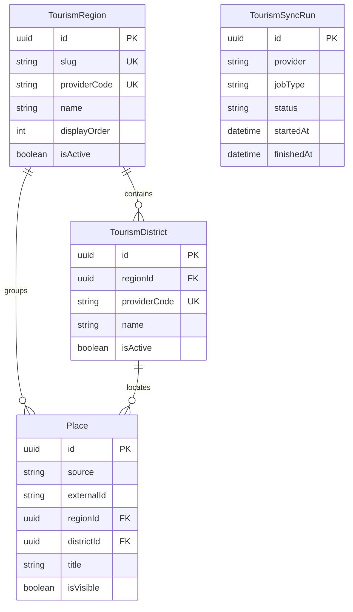

# Haetteum 관광지 데이터베이스 기반 설계

**상태:** 구현 및 검증 완료
**작성일:** 2026-08-21
**범위:** 관광 지역, 시군구, 관광지, 관광 데이터 동기화 실행 이력의 첫 Prisma 모델과 migration

## 1. 배경

설계 당시 Haetteum의 NestJS API에는 PostgreSQL과 Prisma 연결 기반만 있었고 관광
도메인 모델은 아직 없었다. 메인 탐색 화면은 `서울`, `경기`, `강원`, `부산`, `제주`의
지역 필터와 관광지 목록을 요구하지만 현재 화면 계획은 mock 데이터만 사용한다.

한국관광공사 TourAPI `KorService2`는 관광지의 `contentid`, 법정동 코드, 제목,
주소, 좌표, 분류, 대표 이미지, 이미지 저작권 유형과 수정일을 제공한다. 외부 API
응답을 사용자 요청마다 전달하지 않고 내부 PostgreSQL에 동기화한 뒤 Haetteum API가
내부 데이터를 조회하는 방향은 이미 승인되었다.

이번 설계는 이 흐름의 첫 단계로 관광지 데이터를 안전하게 저장하고 갱신할 수 있는
데이터베이스 기반만 확정한다.

## 2. 목표

- TourAPI 법정동 시도와 시군구 코드를 내부 지역 데이터로 관리한다.
- TourAPI 관광지 `contentid`와 Haetteum 내부 UUID를 분리한다.
- 메인 지역별 관광지 조회에 필요한 필드를 정규화해 저장한다.
- 외부 관광지가 비표출 상태로 변경돼도 기존 내부 참조가 끊기지 않게 한다.
- 외부 제공 시각과 내부 동기화 시각을 구분한다.
- 전체·증분 동기화 실행 결과와 마지막 성공 기준을 추적한다.
- 향후 인기순위, 이미지, 축제, 후기 데이터를 관광지 기본정보와 분리해 확장할 수
  있게 한다.

## 3. 이번 단계의 비목표

이번 첫 데이터베이스 단계에서는 다음을 구현하지 않는다.

- TourAPI 서비스키 발급 또는 실제 외부 API 호출
- 스케줄러, 큐, cron과 일일 자동 동기화 실행
- 관광지 공개 HTTP endpoint와 공유 Zod 계약
- 한국관광 데이터랩 CSV 다운로드 또는 인기순위 적재
- 행사·축제, 추가 관광지 이미지, 후기와 평점 모델
- AI 추천 후보 선정
- PostGIS, 거리 검색, 전문 검색 확장
- 관리자 업로드 화면
- Repository 추상화
- Git stage, commit, branch 또는 push

첫 migration 이후 외부 동기화와 공개 조회는 각각 독립 설계·계획으로 진행한다.

## 4. 데이터 소유권과 원칙

1. `apps/api`만 Prisma 모델과 관광 데이터 저장을 소유한다.
2. 브라우저와 `apps/web`은 Prisma 타입 또는 외부 TourAPI 응답을 직접 사용하지
   않는다.
3. TourAPI 식별자는 문자열로 저장하고 Haetteum 내부 식별자는 UUID를 사용한다.
4. TourAPI 응답 전체를 JSONB 한 필드에 저장하지 않는다. 현재 조회와 동기화에
   필요한 필드를 명시적인 컬럼으로 정규화한다.
5. 외부 비표출은 물리 삭제가 아니라 `isVisible = false`로 반영한다.
6. 관광지 기본정보, 인기순위, 후기 집계는 서로 다른 출처와 갱신 주기를 가지므로
   같은 컬럼에 섞지 않는다.
7. 첫 동기화 범위는 TourAPI `contentTypeId = 12`인 관광지로 제한한다. 문화시설
   `14`, 행사·축제 `15`, 레포츠 `28` 등은 후속 범위에서 명시적으로 추가한다.

## 5. 테이블 관계



`TourismSyncRun`은 실행 단위 감사 기록이다. 각 관광지와 실행 이력 사이의 전체
다대다 처리 기록은 첫 단계에 저장하지 않으며 `Place.lastSyncedAt`으로 개별
관광지의 마지막 정상 반영 시각을 추적한다.

## 6. `TourismRegion`

광역시·도 단위의 제품 필터와 TourAPI 법정동 시도 코드 사이를 연결한다.

| 필드 | Prisma/PostgreSQL | 규칙 |
|---|---|---|
| `id` | `String @id @default(uuid()) @db.Uuid` | 내부 식별자 |
| `slug` | `String @unique` | API·웹에서 사용할 안정적인 영문 값 |
| `name` | `String` | 사용자 표시명 |
| `providerCode` | `String @unique` | TourAPI 법정동 시도 코드 |
| `displayOrder` | `Int` | 메인 필터 표시 순서 |
| `isActive` | `Boolean @default(true)` | 제품 노출 여부 |
| `createdAt` | `DateTime @default(now())` | 내부 생성 시각 |
| `updatedAt` | `DateTime @updatedAt` | 내부 수정 시각 |

초기 제품 매핑은 아래와 같다.

| `slug` | `name` | `providerCode` |
|---|---|---|
| `seoul` | 서울 | `11` |
| `gyeonggi` | 경기 | `41` |
| `gangwon` | 강원 | `51` |
| `busan` | 부산 | `26` |
| `jeju` | 제주 | `50` |

초기 행 생성 방식은 임의 seed 스크립트가 아니라 첫 migration의 고정 기준
데이터로 관리한다. 이 다섯 값은 승인된 메인 화면 계약과 TourAPI 코드표를 함께
충족하는 제품 설정이다.

## 7. `TourismDistrict`

시·군·구를 저장한다. 메인 첫 화면은 광역 단위만 조회하지만 주소 표시, 외부 데이터
정합성 확인과 향후 시군구 필터를 위해 첫 모델에 포함한다.

| 필드 | Prisma/PostgreSQL | 규칙 |
|---|---|---|
| `id` | `String @id @default(uuid()) @db.Uuid` | 내부 식별자 |
| `regionId` | `String @db.Uuid` | `TourismRegion` FK |
| `providerCode` | `String @unique` | TourAPI 법정동 시군구 코드 |
| `name` | `String` | 사용자 표시명 |
| `isActive` | `Boolean @default(true)` | 사용 여부 |
| `createdAt` | `DateTime @default(now())` | 내부 생성 시각 |
| `updatedAt` | `DateTime @updatedAt` | 내부 수정 시각 |

`regionId`에 일반 인덱스를 둔다. 시군구 코드는 전국 범위에서 고유한 TourAPI
법정동 코드를 사용하므로 `providerCode`를 단독 unique로 유지한다.

## 8. `Place`

TourAPI 관광지의 정규화된 내부 표현이다.

| 필드 | Prisma/PostgreSQL | 규칙 |
|---|---|---|
| `id` | `String @id @default(uuid()) @db.Uuid` | 공개 계약에 사용할 내부 ID |
| `source` | `String` | 첫 값은 `TOUR_API` |
| `externalId` | `String` | TourAPI `contentid` |
| `contentTypeId` | `Int` | 첫 동기화 값은 `12` |
| `regionId` | `String @db.Uuid` | 광역 지역 FK |
| `districtId` | `String? @db.Uuid` | 시군구 FK, 제공 누락 시 nullable |
| `title` | `String` | 관광지명 |
| `address1` | `String?` | 기본 주소 |
| `address2` | `String?` | 상세 주소 |
| `zipcode` | `String?` | 우편번호 |
| `longitude` | `Decimal? @db.Decimal(10, 7)` | WGS84 경도 |
| `latitude` | `Decimal? @db.Decimal(10, 7)` | WGS84 위도 |
| `mapLevel` | `Int?` | TourAPI 지도 레벨 |
| `category1` | `String?` | 신분류 대분류 |
| `category2` | `String?` | 신분류 중분류 |
| `category3` | `String?` | 신분류 소분류 |
| `telephone` | `String?` | 안내 전화 |
| `homepage` | `String? @db.Text` | 상세 공통정보 보강 값 |
| `overview` | `String? @db.Text` | 상세 공통정보 보강 값 |
| `primaryImageUrl` | `String? @db.Text` | 대표 원본 이미지 URL |
| `primaryThumbnailUrl` | `String? @db.Text` | 대표 썸네일 URL |
| `imageCopyrightType` | `String?` | `Type1`, `Type3` 등 원본 값 |
| `providerCreatedAt` | `DateTime?` | 외부 콘텐츠 등록 시각 |
| `providerModifiedAt` | `DateTime` | 외부 콘텐츠 수정 시각 |
| `isVisible` | `Boolean @default(true)` | TourAPI 표출 상태 |
| `lastSyncedAt` | `DateTime` | 내부 DB에 마지막 정상 반영된 시각 |
| `createdAt` | `DateTime @default(now())` | 내부 생성 시각 |
| `updatedAt` | `DateTime @updatedAt` | 내부 수정 시각 |

필수 제약과 인덱스는 다음과 같다.

```text
UNIQUE (source, externalId)
INDEX  (regionId, isVisible)
INDEX  (districtId, isVisible)
INDEX  (contentTypeId, isVisible)
INDEX  (providerModifiedAt)
```

`title`의 부분 검색을 위한 PostgreSQL `pg_trgm`과 GIN 인덱스는 검색 endpoint의
실제 쿼리와 데이터량을 확인한 뒤 별도 migration으로 추가한다. 첫 migration에는
사용되지 않는 확장을 미리 넣지 않는다.

## 9. `TourismSyncRun`

전체 적재, 증분 적재와 향후 공식 순위 import의 실행 단위 상태를 저장한다.

| 필드 | Prisma/PostgreSQL | 규칙 |
|---|---|---|
| `id` | `String @id @default(uuid()) @db.Uuid` | 실행 식별자 |
| `provider` | `String` | `TOUR_API`, 향후 `DATA_LAB` |
| `jobType` | `String` | `FULL`, `INCREMENTAL`, 향후 `RANKING_IMPORT` |
| `status` | `String` | `RUNNING`, `SUCCEEDED`, `FAILED` |
| `requestedFrom` | `DateTime?` | 증분 요청에 사용한 시작 기준 |
| `startedAt` | `DateTime @default(now())` | 실행 시작 시각 |
| `finishedAt` | `DateTime?` | 실행 종료 시각 |
| `fetchedCount` | `Int @default(0)` | 외부에서 받은 수 |
| `insertedCount` | `Int @default(0)` | 신규 수 |
| `updatedCount` | `Int @default(0)` | 수정 수 |
| `deactivatedCount` | `Int @default(0)` | 비표출 전환 수 |
| `failedCount` | `Int @default(0)` | 개별 처리 실패 수 |
| `errorSummary` | `String? @db.Text` | 비밀정보를 제거한 오류 요약 |

`provider`, `status`, `finishedAt` 복합 인덱스를 둔다. 증분 동기화의 다음
`requestedFrom`은 동일 provider에서 가장 최근에 완료된 `SUCCEEDED` 실행을
기준으로 계산한다. 실패 실행과 `RUNNING` 실행은 워터마크를 전진시키지 않는다.

`status`와 `jobType`은 첫 단계에서 문자열로 저장하고 애플리케이션 계층에서
허용값을 검증한다. 외부 provider와 job 종류가 확장될 때마다 PostgreSQL enum
migration을 만들지 않기 위한 결정이다.

## 10. 저장하지 않는 값

다음 값은 `Place`에 두지 않는다.

- `rank`: 지역·기간·대상별 값이므로 후속 `PlaceRanking`이 소유한다.
- `rating`, `reviewCount`: TourAPI 값이 아니며 향후 후기 도메인이 소유한다.
- 저장 여부: 사용자별 관계이므로 인증·저장 기능이 소유한다.
- AI 추천 점수와 이유: 추천 use case가 생성한다.
- 원본 TourAPI 응답 전체: 별도 raw mirror는 현재 운영 요구가 없다.

## 11. 향후 확장 경계

### `PlaceRanking`

공식 데이터랩 CSV의 실제 컬럼을 확인한 후 별도 설계한다. 최소한 `placeId?`,
`regionId`, `source`, `rankingType`, `audience`, `periodStart`, `periodEnd`, `rank`,
`metricValue?`, `metricUnit?`, `sourcePlaceName`, `sourceCategory?`, `importedAt`을
분리해 저장한다. CSV에 TourAPI `contentid`가 없을 수 있으므로 `placeId`는
nullable이어야 한다.

### `PlaceImage`

관광지 상세 화면에서 복수 이미지를 요구할 때 추가한다. 대표 이미지 하나는 첫
화면 요구를 충족하므로 현재는 `Place`에 URL과 저작권 유형을 저장한다.

### `Festival`

행사·축제는 시작일과 종료일을 가지는 별도 수명주기의 콘텐츠이므로 `Place`의
`contentTypeId`만 바꿔 억지로 저장하지 않는다. 축제 화면 데이터 연결 설계에서
독립 모델을 추가한다.

## 12. 향후 데이터 흐름

이번 단계에서는 실행하지 않지만 후속 동기화 구현은 아래 경계를 따른다.

```text
TourAPI KorService2
  → TourApiClient: HTTP, timeout, JSON/XML 오류 해석
  → TourismSyncService: 코드 매핑, 검증, 정규화, 실행 상태
  → PrismaService: upsert와 비표출 반영
  → PostgreSQL
```

공개 조회는 외부 API를 호출하지 않고 아래 흐름만 사용한다.

```text
Next.js
  → GET /api/v1/places?region=jeju
  → PlacesController
  → ListPlacesUseCase
  → PrismaService
  → PostgreSQL
```

Repository 추상화는 추가하지 않는다. 첫 조회와 동기화 use case는 Prisma를 직접
사용하고, 외부 provider가 복수화되거나 복잡한 교체 규칙이 실제로 생길 때 다시
검토한다.

## 13. 오류와 데이터 정합성

- 알 수 없는 지역 코드를 받은 관광지는 임의 지역에 넣지 않고 해당 항목을 실패
  처리한다.
- 시군구 코드가 누락되면 `districtId = null`을 허용하되 광역 지역은 필수다.
- 필수 `externalId`, `title`, `providerModifiedAt`이 없으면 적재하지 않는다.
- 같은 `(source, externalId)`는 생성하지 않고 외부 수정시각을 비교해 upsert한다.
- 외부 수정시각이 현재 저장 값보다 오래된 응답은 최신 데이터를 덮어쓰지 않는다.
- 비표출 데이터는 `isVisible = false`로 전환하고 물리 삭제하지 않는다.
- 한 항목이라도 적재에 실패하면 실행 상태를 `FAILED`로 종료한다. 먼저 정상 반영된
  항목은 idempotent upsert 결과로 유지하되 마지막 성공 기준은 전진시키지 않으며,
  다음 실행이 같은 범위를 다시 처리한다.
- 실패 실행은 기존 관광지 데이터를 삭제하거나 마지막 성공 기준을 갱신하지 않는다.
- `errorSummary`에는 service key, 전체 요청 URL, 원본 응답 body와 내부 stack을
  저장하지 않는다.

## 14. migration과 기준 데이터

첫 migration은 네 모델, 관계, unique 제약과 인덱스를 한 번에 생성한다. Prisma
generated client는 migration 산출물이 아니며 직접 수정하거나 Git에 추가하지
않는다.

다섯 광역 지역은 첫 migration SQL의 기준 데이터로 삽입한다. migration을 다시
적용해도 중복되지 않게 고유 `slug`와 `providerCode`를 사용한다. 시군구 행과
관광지 행은 migration에 넣지 않고 후속 공식 코드·관광지 동기화가 생성한다.

첫 migration 적용 전 기존 데이터베이스에는 도메인 테이블이 없었으므로 데이터
변환이나 backfill도 없었다. 기존 health endpoint와 Prisma 연결 동작은 유지한다.

## 15. 검증 기준

### Prisma와 데이터베이스

- `prisma format`과 `prisma validate`가 통과한다.
- migration이 빈 PostgreSQL 데이터베이스에 적용된다.
- 동일 migration 재실행 또는 deploy가 기준 지역 중복을 만들지 않는다.
- 다섯 광역 지역의 slug, 이름, provider code와 표시 순서가 정확하다.
- `(source, externalId)` 중복 관광지를 데이터베이스가 거부한다.
- 존재하지 않는 지역 또는 시군구 FK를 가진 관광지를 데이터베이스가 거부한다.
- 시군구가 없는 관광지는 저장할 수 있다.
- 관광지를 비표출로 변경해도 레코드와 내부 UUID가 유지된다.

### 저장소 회귀 검증

- API lint, unit test, build가 통과한다.
- API e2e health test가 기존과 동일하게 통과한다.
- workspace 전체 lint, test와 build가 통과한다.
- `git diff --check`가 통과한다.

## 16. 수용 기준

- `TourismRegion`, `TourismDistrict`, `Place`, `TourismSyncRun` 모델과 첫 도메인
  migration이 존재한다.
- 다섯 승인 지역이 기준 데이터로 존재한다.
- 관광지 외부 ID와 내부 UUID가 분리된다.
- 외부 비표출을 물리 삭제 없이 표현할 수 있다.
- 메인 지역 필터용 조회 인덱스가 존재한다.
- 마지막 성공 동기화 기준과 실행 결과를 표현할 수 있다.
- 인기순위, 후기, 축제와 복수 이미지는 첫 migration에 포함되지 않는다.
- 외부 API 호출, scheduler와 공개 endpoint는 이번 단계에 포함되지 않는다.
- 기존 health와 공통 HTTP 경계가 변경되지 않는다.
- Git 작업은 별도 사용자 승인 전 실행하지 않는다.
